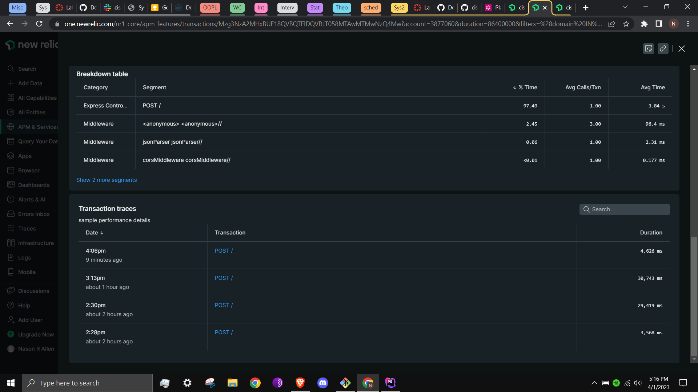
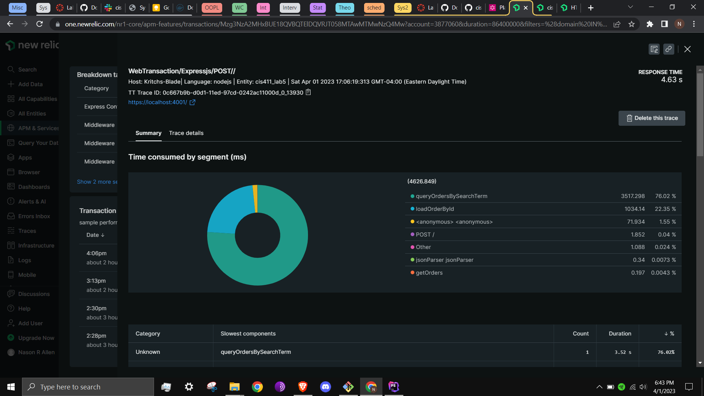

# Lab Report: Monitoring
___
**Course:** CIS 411, Spring 2021  
**Instructor(s):** [Trevor Bunch](https://github.com/trevordbunch)  
**Name:** Nason Allen  
**GitHub Handle:** 02NRA  
**Repository:** [https://github.com/02NRA/cis411_lab5_Monitoring](https://github.com/02NRA/cis411_lab5_Monitoring)  
**Collaborators:** aidan-hubley (helped clarify terminology)
___

# Step 1: Fork this repository
- The URL of my forked repository:
  [https://github.com/02NRA/cis411_lab5_Monitoring](https://github.com/02NRA/cis411_lab5_Monitoring)
# Step 2: Clone your forked repository from the command line
- My GraphQL response from adding myself as an account on the test project
```
{
  "data": {
    "mutateAccount": {
      "id": "44d60ceb-36a4-4f2f-99dd-ede41997e880",
      "name": "Nason Allen",
      "email": "na1205@messiah.edu"
    }
  }
}
```

# Step 3: Signup for and configure New Relic
- The chosen name of your New Relic ```app_name``` configuration
```
app_name: ['cis411_lab5']
```

# Step 4: Exercising the application / generating performance data

_Note: No lab notes required._

# Step 5: Explore your performance data
* What are your observations regarding the performance of this application? 
  > Though it does not handle user errors in the most elegant way on the front end, it is otherwise quite consistant and easy-to use, from an interface and performance standpoint.
* Is performance even or uneven? 
  > Performance is even, relative to a larger, "real-world" system. This is likely due to each query requesting similar data, in type and amount.
* Between queries and mutations, what requests are less performant? 
  > The least performant queries are the ones that request the most data (their search criteria are the broadest/it is easiest for any given datapoint to meet the search criteria). Query 6 specifically was the least performant (had the longest response time), because more orders meet the criterion of "everything" than "raisin", for example.
* Among the less performant requests, which ones are the most problematic?
  > The most problematic request overall was the one that returned an error: query 7. The error states that the user cannot query the field "items" on the type "account". In New Relic, it is displayed with the statement "Error rate was much different from normal", as the other queries ran smoothly. I would need a better understanding of the table structure of the test data so that I could properly reformat the query (change the field name to the actual intended terminology). I am prevented from doing this, as Windows warns me not to edit bagels.db.

# Step 6: Diagnosing an issue based on telemetry data
* Within the transactions you're examining, what segment(s) took the most time?
  > "POST /" is by far the most time consuming segment:
  
* Using New Relic, identify and record the least performant request(s).
  > As mentioned in step 5, the requests that are most problematic are the ones that query the most data (generally have the loosest criteria for a datapoint to match).
* Using the Transaction Trace capability in New Relic, identify which segment(s) in that request permeation is/are the most problematic and record your findings.
  > The most problematic request permeation is queryOrdersBySearchTerm (76.02%):
  
* Recommend a solution for improving the performance of those most problematic request(s) / permeation(s).
  > If our only concern was to specifically aleviate POST, it would be enough to shift some of its function to other services/segments. However, practically, it would be best to send the query results piecemeal, like when a user presses "see more results" or some equivilent. In this way, the maximum number of items processed by the service at one time is decreased. 

# Step 7: Submitting a Pull Request
_Note: No lab notes required._

# Step 8: [EXTRA CREDIT] Address the performance issue(s)
For the purposes of gaining 25% extra credit on the assignment, perform any of the following:
1. Adjust the diagnosed slow call(s) to improve performance. 
2. Verify the improved performance in New Relic, **including data and/or screenshots in your lab report**.
2. Check in those changes and **note your solution(s)** in your lab report.