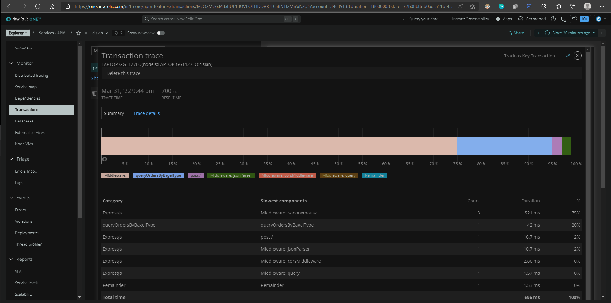

# Lab Report: Monitoring
___
**Course:** CIS 411, Spring 2021  
**Instructor(s):** [Trevor Bunch](https://github.com/trevordbunch)  
**Name:** Your Name  
**GitHub Handle:** Your GitHub Handle  
**Repository:** Your Forked Repository  
**Collaborators:** 
___

# Step 1: Fork this repository
- [The URL of my forked repository](https://github.com/AmmanuelT/cis411_lab5_Monitoring)

# Step 2: Clone your forked repository from the command line
- My GraphQL response from adding myself as an account on the test project
```
{
  "data": {
    "mutateAccount": {
      "id": "97c40d00-ab9b-48ac-b671-ff1bb996106b",
      "name": "AMMANUEL TAMRAT",
      "email": "at1345@maessiah.edu"
    }
  }
}
```

# Step 3: Signup for and configure New Relic
- The chosen name of your New Relic ```app_name``` configuration
```
app_name: ['cislab']
```

# Step 4: Exercising the application / generating performance data

_Note: No lab notes required._

# Step 5: Explore your performance data
* What are your observations regarding the performance of this application? 
  > The performance of this app is poor. According to new relic most transactions have the user tolerating the app or frustrated. There were no errors appart from query 7 because accounts do not have item fields.
* Is performance even or uneven? 
  > The performance was very uneven. Queries 1 and 6 took the longest time with response times of 8k ms for Query 1 and 63k ms for Query 6. Queries 2 and 4 took the least amount of time at 403 ms and 367 ms respectively. Queries 3 and 5 performed similarly with response times of 706 ms and 798 ms. Finally query 7 resulted in an error.
* Between queries and mutations, what requests are less performant? 
  > The mutations took less than 100ms wand where rated as excelent while the querries took much longer and were usually rated poor or unacceptable.
* Among the less performant requests, which ones are the most problematic?
  > Among the queries the ones that looked for orders containing a certain word were by far the least performant. The queries by location were the most performant. The querries that checked whether a certain item contains a type of baguel were in between.

# Step 6: Diagnosing an issue based on telemetry data
* Within the transactions you're examining, what segment(s) took the most time?
  > Within the transactions that took more than 60k ms the remainder segment took 95% of the time.
* Using New Relic, identify and record the least performant request(s).
  > The least performance requests according to New Relic are the queries that query by a word.
* Using the Transaction Trace capability in New Relic, identify which segment(s) in that request permeation is/are the most problematic and record your findings.
  > For both the queries that search for orders witha specific word in them the remainder segment is the most problematic.
* Recommend a solution for improving the performance of those most problematic request(s) / permeation(s).
  > For Query 1 we know that PA is a location so querying by location instead of having to check for the word PA in every order would make the request perform better. For Query 2 querying for orders with an item that contains an everyting bagel would perform much better than checking if the word everything is contained in each order.<br> The Query for all accounts that contain gmail.com also failed because accounts dont have an item feild. To fix this I would remove the items from the Query.

# Step 7: Submitting a Pull Request
_Note: No lab notes required._

# Step 8: [EXTRA CREDIT] Address the performance issue(s)
For the purposes of gaining 25% extra credit on the assignment, perform any of the following:
1. Adjust the diagnosed slow call(s) to improve performance. 
   I changed the Query 6 to:<br>
```
{
  #Query 6: retrieve all orders container the word everything
  orders(query: "everything") {
    id
    customer {
      id
      email
    }
    items {
      label
      quantity
    }
  }
}
```

1. Verify the improved performance in New Relic, **including data and/or screenshots in your lab report**. <br>
   The new Query runs in 700ms instead of 70k ms <br>
   
2. Check in those changes and **note your solution(s)** in your lab report.