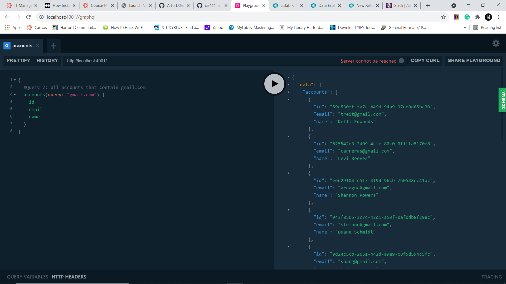
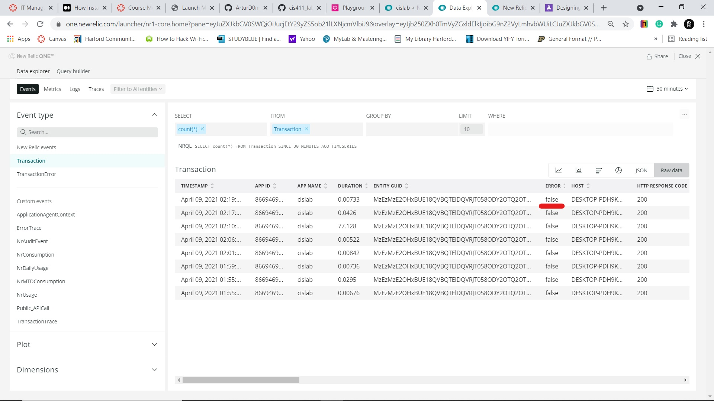

# Lab Report: Monitoring
___
**Course:** CIS 411, Spring 2021  
**Instructor(s):** [Trevor Bunch](https://github.com/trevordbunch)  
**Name:** Artur Donnelly  
**GitHub Handle:** [ArturD0nnelly](https://github.com/ArturD0nnelly)  
**Repository:** [cis_lab5_Monitoring](https://github.com/ArturD0nnelly/cis411_lab5_Monitoring)  
**Collaborators:** 
___

# Step 1: Fork this repository
- [The URL of my forked repository](https://github.com/ArturD0nnelly/cis411_lab5_Monitoring)

# Step 2: Clone your forked repository from the command line
- My GraphQL response from adding myself as an account on the test project
```
{
  "data": {
    "mutateAccount": {
      "id": "63116500-f0c7-4546-8b1c-ea100c05dbc8",
      "name": "Artur Donnelly",
      "email": "ad1425@messiah.edu"
    }
  }
}
```

# Step 3: Signup for and configure New Relic
- The chosen name of your New Relic ```app_name``` configuration
```
app_name: ['cislab']
```

# Step 4: Exercising the application / generating performance data


# Step 5: Explore your performance data
* What are your observations regarding the performance of this application? 
  > The application performed well, regarding one query that ends up with an error. All of the requests went through pretty fast, regarding the request that was asking for all of the items. 
* Is performance even or uneven? 
  > The performance is uneven since the requests are different and each of them taking a different amount of time to process.
* Between queries and mutations, what requests are less performant? 
  > The query that was less performed was query number 7 since this query ends up with an error. Also, query number 6 showed to be less performant in the amount of time it took to execute it. 
* Among the less performant requests, which ones are the most problematic?
  > Among the less performant requests number 7 is most problematic. Request number 7 end up with an error, which would be more problematic than the request that took longer and still given the right output.

# Step 6: Diagnosing an issue based on telemetry data
* Within the transactions you're examining, what segment(s) took the most time?
  > Within most of the transactions the segment defined as queryOrdersBySearchTerm took most of the time.
* Using New Relic, identify and record the least performant request(s).
  > The least performant request was request number 6, which took the longest to execute. Also, request number 7 returned an error, which I think that getting an error would consider being low performance.
* Using the Transaction Trace capability in New Relic, identify which segment(s) in that request permeation is/are the most problematic and record your findings.
  > In request number 6 the most problematic segment would be queryOrderBySearchTerm, which has the highest duration. The information about the segments in request number 7 is not available, but I believe that the problem with that request is that it can not find the item that was defined as "gmail.com". 
* Recommend a solution for improving the performance of those most problematic request(s) / permeation(s).
  > For request number 7 that returned an error when requesting for all accounts that are under gmail.com, I changed it to retrieve id, email, and name. After that, all of the accounts that contain gmail.com came up. 
  For request number 6 I would recommend specifying the item instead of requesting every single one. This would highly improve the performance.
  

# Step 7: Submitting a Pull Request


# Step 8: [EXTRA CREDIT] Address the performance issue(s)
Here is what I did. All accounts with gmail were given: 
  
  And here we can see that arrow is false this time:
  