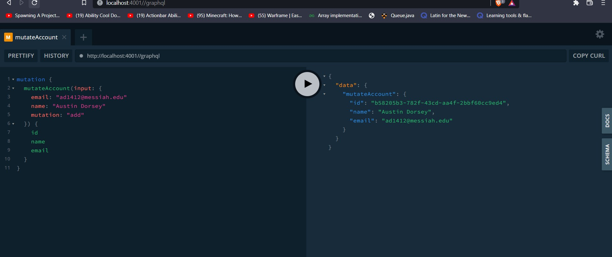

# Lab Report: Monitoring
___
**Course:** CIS 411, Spring 2021  
**Instructor(s):** [Trevor Bunch](https://github.com/trevordbunch)  
**Name:** Austin Dorsey  
**GitHub Handle:** Dorsecles  
**Repository:** https://github.com/Dorsecles/cis411_lab5_Monitoring  
**Collaborators:** 
___

# Step 1: Fork this repository
- https://github.com/Dorsecles/cis411_lab5_Monitoring

# Step 2: Clone your forked repository from the command line
- My GraphQL response from adding myself as an account on the test project
- 
```
{
  "data": {
    "mutateAccount": {
      "id": "a10db030-ded8-4397-a78f-30b79d3497ab",
      "name": "MY NAME",
      "email": "MY EMAIL"
    }
  }
}
```

# Step 3: Signup for and configure New Relic
- The chosen name of your New Relic ```app_name``` configuration
```
app_name: ['<YOUR APP NAME>']
```

# Step 4: Exercising the application / generating performance data

_Note: No lab notes required._

# Step 5: Explore your performance data
* What are your observations regarding the performance of this application? 
  > Some of the queries would take much longer than others. One didn't even work.
* Is performance even or uneven? 
  >The performance seemed uneven.
* Between queries and mutations, what requests are less performant? 
  > Queries 6 and 7 were among the least performant.
* Among the less performant requests, which ones are the most problematic?
  > Query 7 was the most problematic because it did not work.

# Step 6: Diagnosing an issue based on telemetry data
* Within the transactions you're examining, what segment(s) took the most time?
  > Query 6 took the longest. It took 16,900 milliseconds to finish running.
* Using New Relic, identify and record the least performant request(s).
  > Query 7 gave an error so it was the most problematic and least performant.
* Using the Transaction Trace capability in New Relic, identify which segment(s) in that request permeation is/are the most problematic and record your findings.
  > The error that query 7 gave was that it could not find 'items' in 'accounts'.
* Recommend a solution for improving the performance of those most problematic request(s) / permeation(s).
  > For Query 6 I suggest instead of using 'query' on line 3 you should use 'bagel' because after doing this it went from 16,900 milliseconds response time down to 123 milliseconds response time. Query 7 seems to have trouble finding item in accounts and that is causing the error. There is probably something that needs to be added to server.js that can allow items to be accessed.

# Step 7: Submitting a Pull Request
_Note: No lab notes required._

# Step 8: [EXTRA CREDIT] Address the performance issue(s)
For the purposes of gaining 25% extra credit on the assignment, perform any of the following:
1. Adjust the diagnosed slow call(s) to improve performance. 
2. Verify the improved performance in New Relic, **including data and/or screenshots in your lab report**.
2. Check in those changes and **note your solution(s)** in your lab report.