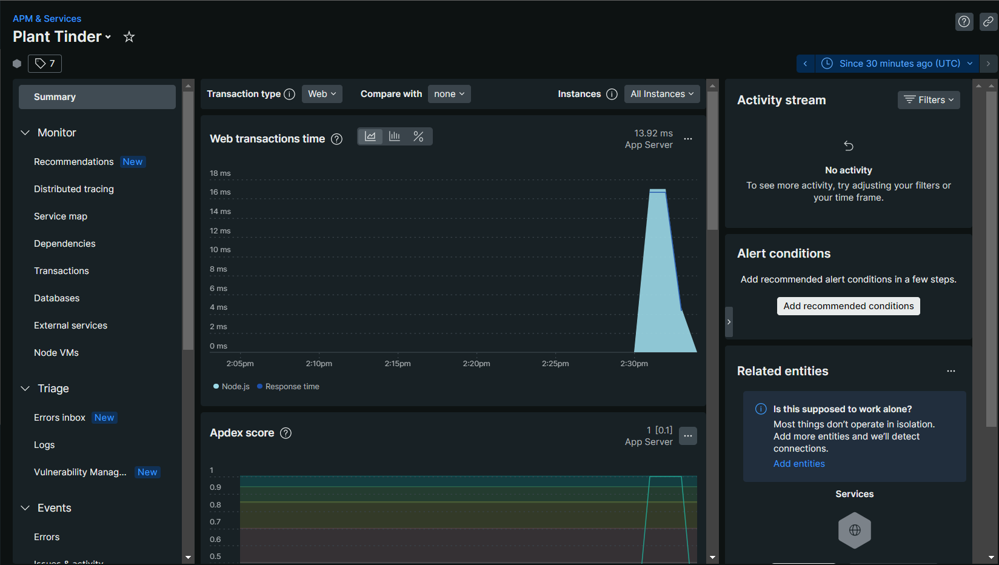
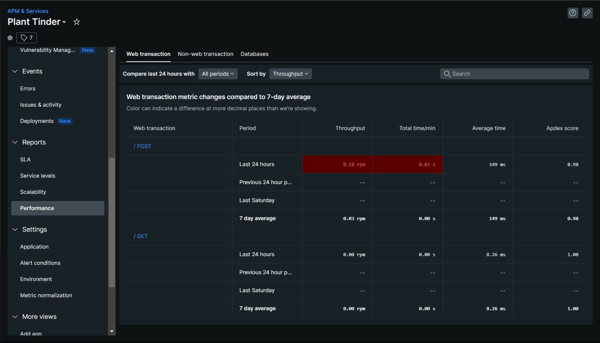
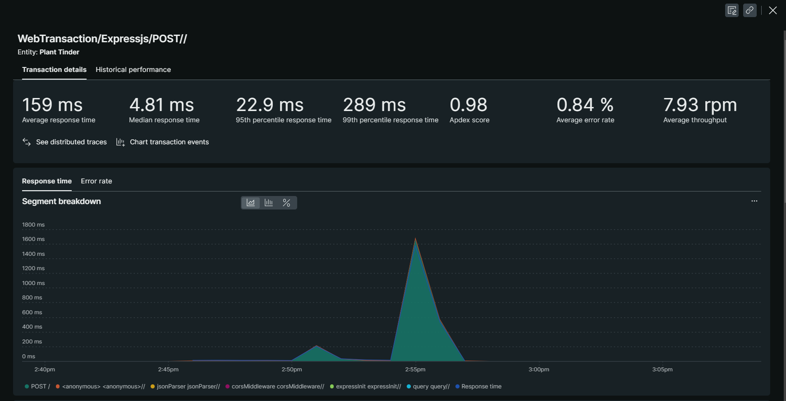
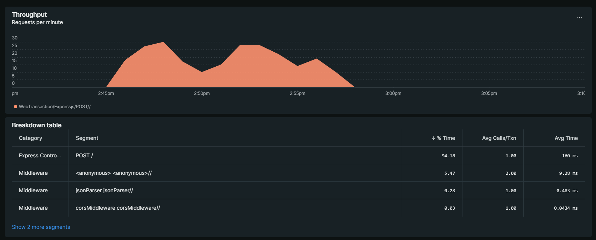
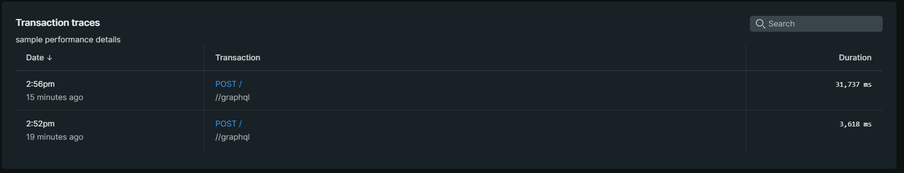
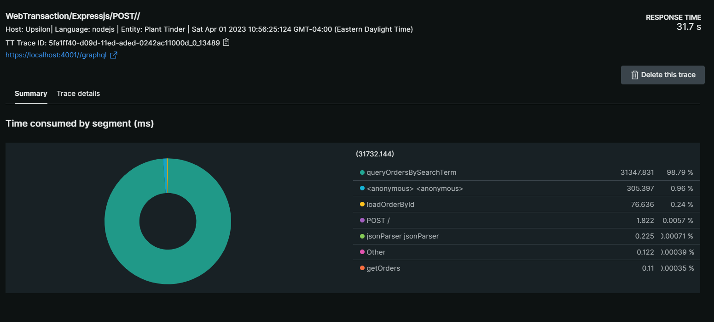
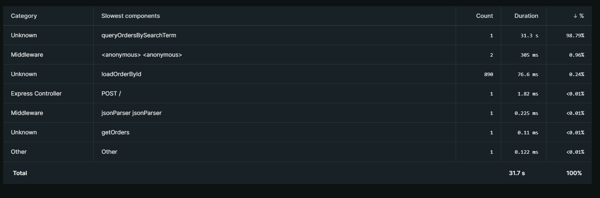

# Lab Report: Monitoring
___
**Course:** CIS 411, Spring 2021  
**Instructor(s):** [Trevor Bunch](https://github.com/trevordbunch)  
**Name:** Your Name  
**GitHub Handle:** Your GitHub Handle  
**Repository:** Your Forked Repository  
**Collaborators:** 
___

# Step 1: Fork this repository
- The URL of my forked repository

# Step 2: Clone your forked repository from the command line
- My GraphQL response from adding myself as an account on the test project
```
{
  "data": {
    "mutateAccount": {
      "id": "054f4272-031f-42ff-a729-5dd75ada0258",
      "name": "Justin Ayres",
      "email": "justin5208@me.com"
    }
  }
}
```

# Step 3: Signup for and configure New Relic
- The chosen name of your New Relic ```Plant Tinder``` configuration
```
app_name: ['Plant Tinder']
```

# Step 4: Exercising the application / generating performance data

_Note: No lab notes required._

# Step 5: Explore your performance data
* What are your observations regarding the performance of this application? 
  > Whenever the query involves a specific search it very efficient and it gets the job done fast, however whenever the query uses a very general term like "everything" it take a long while to complete.
* Is performance even or uneven? 
  > The Performance I would say is very uneven. This is due to the vagueness of some queries, if a query is not very specific it can take a long while to run the query.
* Between queries and mutations, what requests are less performant? 
  > In this lab the queries are a lot less performant, this is because there are queries that need to search through a lot of data. Though I would imagine a mutation can be less performant as well if it has to change a lot of data too...
* Among the less performant requests, which ones are the most problematic?
  > The two that were the biggest problems were one, six, and seven:<br>
  > 1. Number one is a little too vague because it searches for any order containing the word "PA", this I believe is what caused it to take some extra time to complete, though it is nothing compared to number 6.
  <br>
  > 6. Number six was pretty bad, this request was not very specific, it was searching for all orders that contained the word "everything", this means it has to search through and retrieve an incredible amount of data.
  <br>
  > 7. Number seven, while it did return a result very quickly, resulted in an error... 
  
  **Some Performance Screenshots:**















# Step 6: Diagnosing an issue based on telemetry data
* Within the transactions you're examining, what segment(s) took the most time?
  > queryOrdersBySearchTerm took up 98.79% of the time totaling a whopping 31.3 seconds
* Using New Relic, identify and record the least performant request(s).
  > The least performant requests were from queryOrdersBySearchTerm, It is likely that teh two queries that took up most of that time were queries one and six, I think this because as I was running the queries in Graphql their speed, or lack there of, was very noticeable.
* Using the Transaction Trace capability in New Relic, identify which segment(s) in that request permeation is/are the most problematic and record your findings.
  > The most problematic segment, as seen in the Transaction Trace, is the queryOrdersBySearchTerm segment, 
* Recommend a solution for improving the performance of those most problematic request(s) / permeation(s).
  > For number one I would make it the same as order number two, this is because the intention is likely the same for both queries. <br>
  > For number six I would limit the search results, so that it would not actually return everything, but just the first ten results, this would look like this:
  ```
  {
  # Query 6: retrieve all orders containing the word "everything"
  orders(query: "everything", first: 10, after: "<cursor>") {
    pageInfo {
      hasNextPage
      endCursor
    }
    edges {
      cursor
      node {
        id
        customer {
          id
          email
        }
        items {
          label
          quantity
          }
        }
      }
    }
  }

> For number seven Graphql tells us that it does not like the items field, so lets get rid of it, with that we are left with just ID, which wont give us an error, but that's not good enough. So, well throw in email and name in there too to make it more descriptive. This will look like this:<br>
```
{
#Query 7: all accounts w/ email that contains gmail.com
  accounts(query: "gmail.com") {
    id
    email
    name
	}
}
```
# Step 7: Submitting a Pull Request
_Note: No lab notes required._

# Step 8: [EXTRA CREDIT] Address the performance issue(s)
For the purposes of gaining 25% extra credit on the assignment, perform any of the following:
1. Adjust the diagnosed slow call(s) to improve performance. 
2. Verify the improved performance in New Relic, **including data and/or screenshots in your lab report**.
2. Check in those changes and **note your solution(s)** in your lab report.