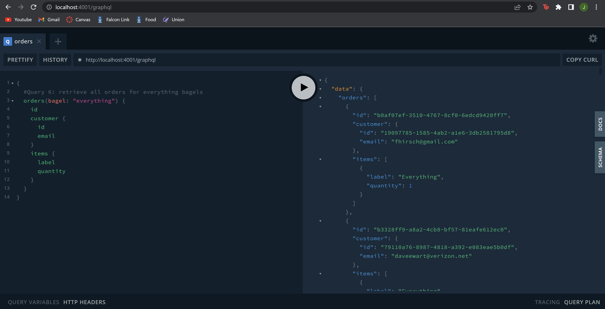
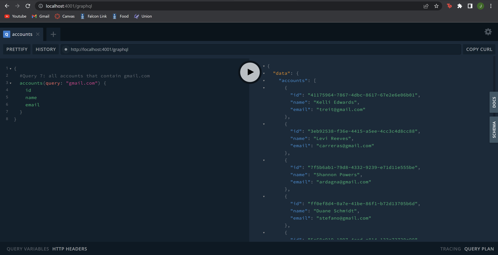
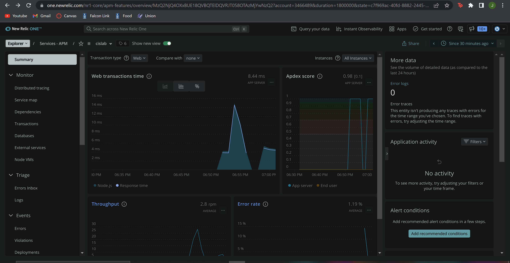

# Lab Report: Monitoring
___
**Course:** CIS 411, Spring 2022
**Instructor(s):** [Trevor Bunch](https://github.com/trevordbunch)  
**Name:** Jamie Padovano <br>
**GitHub Handle:** JPadovano1483 <br>
**Repository:** https://github.com/JPadovano1483/cis411_lab5_Monitoring
___

# Step 1: Fork this repository
- Forked repo URL: https://github.com/JPadovano1483/cis411_lab5_Monitoring

# Step 2: Clone your forked repository from the command line
- My GraphQL response from adding myself as an account on the test project
```
{
  "data": {
    "mutateAccount": {
      "id": "f81ae0f9-8388-40e7-9c38-09550756c331",
      "name": "Jamie Padovano",
      "email": "jp1483@messiah.edu"
    }
  }
}
```

# Step 3: Signup for and configure New Relic
```
app_name: ['cislab']
```

# Step 4: Exercising the application / generating performance data

_Note: No lab notes required._

# Step 5: Explore your performance data
* What are your observations regarding the performance of this application? 
  > The application seems to perform well and have quick response times for most of the queries I ran. There were a couple queries that took considerably longer than the others. These were queries 1 and 6 from the list or queries we ran. In addition, query 7 had errors, so i needed to fix those. After I fixed it, it ran with a fast response time. 
* Is performance even or uneven? 
  > The performance was uneven. There were large spikes in performance and ersponse times. Response times ranged from about 300 ms to about 17,600 ms. 
* Between queries and mutations, what requests are less performant? 
  > Mutations seemed to have very quick response times, so I would say queries were less performant. However, for the faster queries, the response times were comparable to mutation response times. When compared to some of the longer response times for queries, however, mutations were much faster.
* Among the less performant requests, which ones are the most problematic?
  > The most problematic requests were the last two queries. Query 6, where we were trying to retrieve all orders container the word "everything," had a response time of 17,600 ms. Query 7 had some errors preventing it from running properly. After fixing these errors, the request ran quickly. 

# Step 6: Diagnosing an issue based on telemetry data
* Within the transactions you're examining, what segment(s) took the most time?
  > The "remainder" section took the most time. For the longest transaction, it took 92% of the total time, taking 35,400 ms of 38,600 ms total.
* Using New Relic, identify and record the least performant request(s).
  > The least performant request was request 6 that took 17,600 ms to complete. I believe the reaon this request took the longeset was because it needded to go through every single order and return whatever ones contained the word "everything." 
* Using the Transaction Trace capability in New Relic, identify which segment(s) in that request permeation is/are the most problematic and record your findings.
  > The remainder segment takes the longest time across the board. It took anywhere from 72-92% of the total time. The second longest segment was the "queryOrdersBySearchTerm" segment. This took about 7% of the remaining total time. 
* Recommend a solution for improving the performance of those most problematic request(s) / permeation(s).
  > One way I would recommend lowering response time would be to modify queries to do exactly what you want and nothing more. The reason query 6 took so long was because we were looking for the word "everything" in all fields instead of just looking at bagels. Since the word "everything" should only appear in "bagel," we should only search this instead of looking through numerous other lines that we will never find that word in. Of course with the last query, it simply needs to be fixed. It originally was looking for fields from the wrong tables. If we get rid of the part that says items {label, quantity} and replace it with something like "name" and "email," we get a working query.

# Step 7: Submitting a Pull Request
_Note: No lab notes required._

# Step 8: [EXTRA CREDIT] Address the performance issue(s)
For the purposes of gaining 25% extra credit on the assignment, perform any of the following:
1. Adjust the diagnosed slow call(s) to improve performance. 
2. Verify the improved performance in New Relic, **including data and/or screenshots in your lab report**.
2. Check in those changes and **note your solution(s)** in your lab report.

- Query 6 Improvements:<br>

Changed "query" to "bagel"

Replaced items {label, quantity} with "name" and "email"


After changing these queries, the response time peaked at just under 15 ms. 