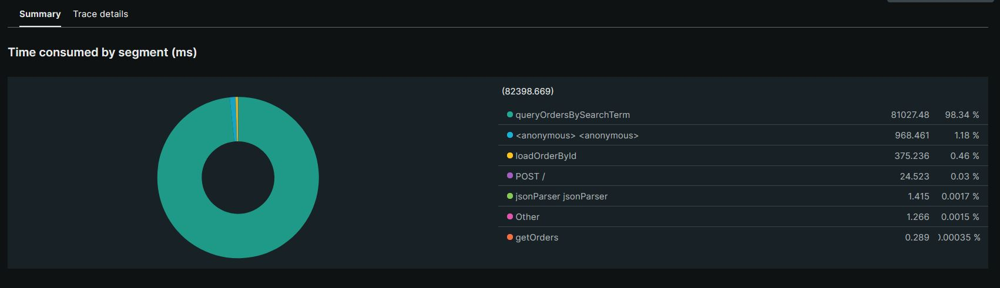
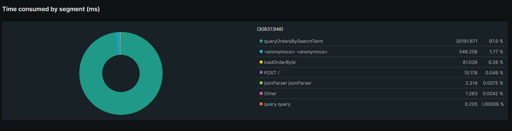

# Lab Report: Monitoring
___
**Course:** CIS 411, Spring 2021  
**Instructor(s):** [Trevor Bunch](https://github.com/trevordbunch)  
**Name:** Luke Hardman
**GitHub Handle:** LAHardman
**Repository:** https://github.com/LAHardman/cis411_lab5_Monitoring 
**Collaborators:** 
___

# Step 1: Fork this repository
[- The URL of my forked repository](https://github.com/LAHardman/cis411_lab5_Monitoring)

# Step 2: Clone your forked repository from the command line
- My GraphQL response from adding myself as an account on the test project
```
{
  "data": {
    "mutateAccount": {
      "id": "fff09604-3181-4270-a090-1b4df031767f",
      "name": "Luke Hardman",
      "email": "lh1392@messiah.edu"
    }
  }
}
```

# Step 3: Signup for and configure New Relic
- The chosen name of your New Relic ```app_name``` configuration
```
app_name: ['<cislab>']
```

# Step 4: Exercising the application / generating performance data

_Note: No lab notes required._

# Step 5: Explore your performance data
* What are your observations regarding the performance of this application? 
  > The application does not seem to perform very well with response times over 40 seconds, and apdex scores below 0.5. The application does not seem able to handle spikes in activity, with slow downs being very prevalent.
* Is performance even or uneven? 
  > Performance is incredibly uneven with apdex scores as high as 1.0 at times with response times in the milliseconds, but at other times it takes over 40 seconds to respond.
* Between queries and mutations, what requests are less performant? 
  > Queries seemed to be less performant than mutations.
* Among the less performant requests, which ones are the most problematic?
  > Retrieving all orders container the word everything seemed to be the most problematic with incredibly delayed response times.

# Step 6: Diagnosing an issue based on telemetry data
* Within the transactions you're examining, what segment(s) took the most time?
  > The "queryOrdersBySearchTerm" segment seemed to take up the majority of the time for these problematic queries.
* Using New Relic, identify and record the least performant request(s).
  > New relic identifies the least performant request as the one with the segments getOrders and queryOrdersBySearchTerm, which seems to support that retrieving all orders that contain the word everything was the post problematic request.
* Using the Transaction Trace capability in New Relic, identify which segment(s) in that request permeation is/are the most problematic and record your findings.
  > The segment queryOrdersBySearchTerm takes up over 98% of the requests processing time, and is by far the most problematic.
* Recommend a solution for improving the performance of those most problematic request(s) / permeation(s).
  > To improve the performance of the problematic request "queryOrdersBySearchTerm," potential solutions include optimizing the query, introducing caching, adding indexes to the database tables, scaling up server resources, and load testing. The specific solution will depend on project constraints and circumstances, and a combination of solutions may be required to achieve desired improvements.

# Step 7: Submitting a Pull Request
_Note: No lab notes required._

# Step 8: [EXTRA CREDIT] Address the performance issue(s)
For the purposes of gaining 25% extra credit on the assignment, perform any of the following:
1. Adjust the diagnosed slow call(s) to improve performance.
> To improve the performance of the slow "orders" query that retrieves all orders containing the word "everything," I adjusted the query to retrieve only the necessary fields, rather than all fields for the matching orders. 
```
{
	orders(query: "everything") {
    id
  	  customer {
    	email
  	  }
    }	
}
```
1. Verify the improved performance in New Relic, **including data and/or screenshots in your lab report**.
> Before the change:
>  
>
> After the change:
> 


2. Check in those changes and **note your solution(s)** in your lab report.