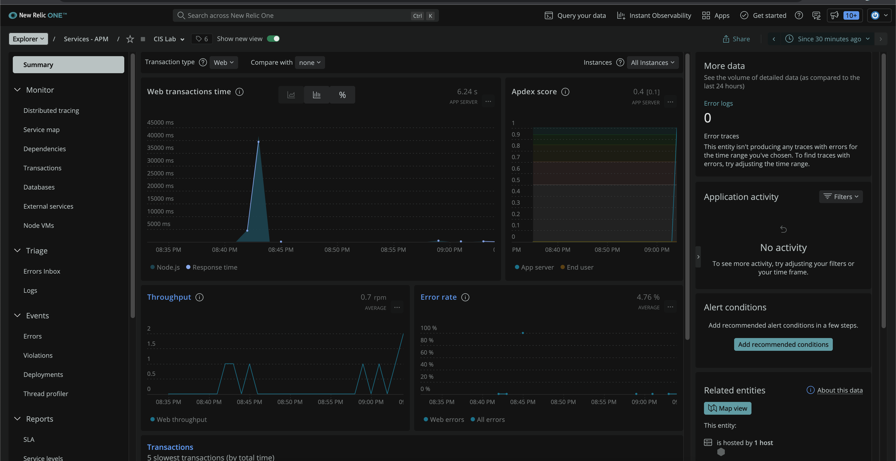
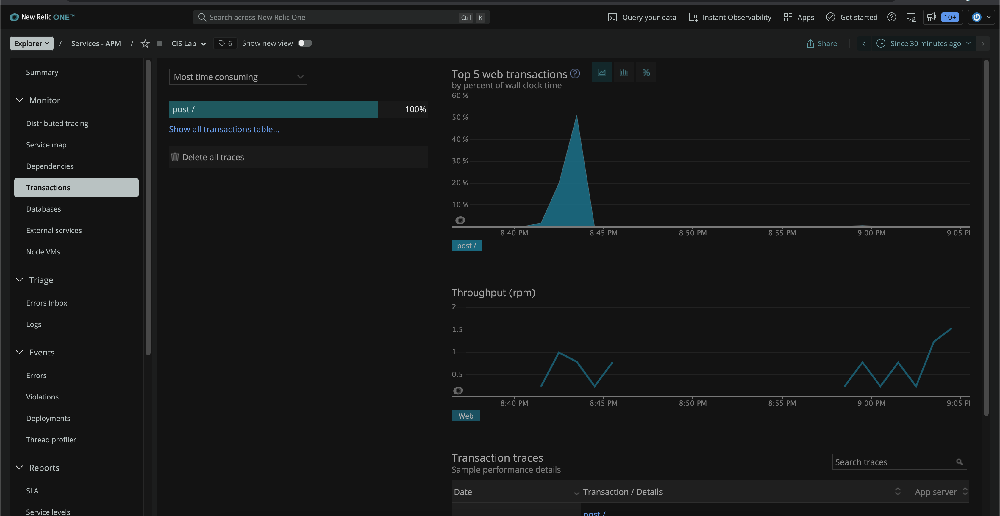
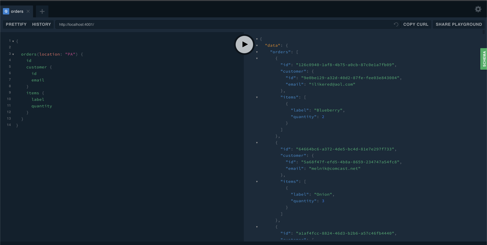
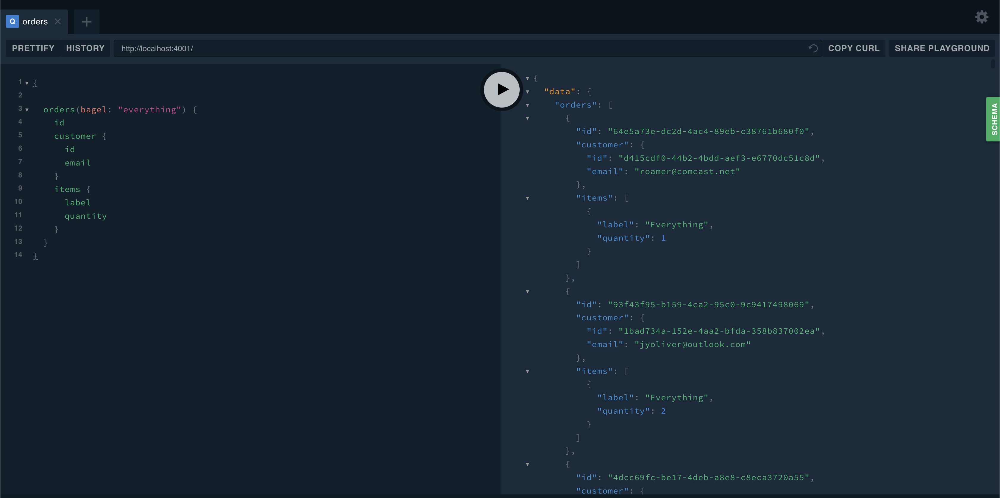
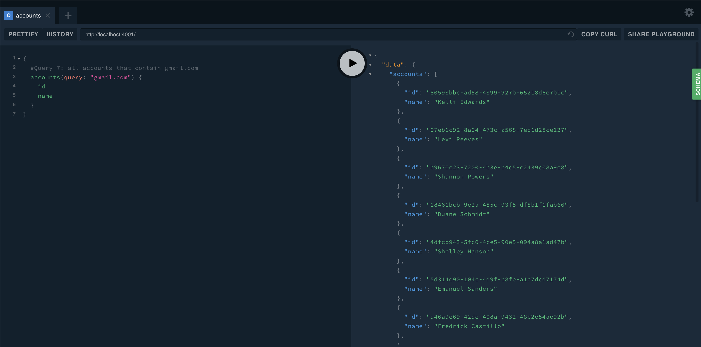

# Lab Report: Monitoring
___
**Course:** CIS 411, Spring 2021  
**Instructor(s):** [Trevor Bunch](https://github.com/trevordbunch)  
**Name:** Reid Burger   
**GitHub Handle:** [Reid Burger](https://github.com/reidburger)   
**Repository:** [My Forked Repository](https://github.com/ReidBurger/cis411_lab5_Monitoring)  
**Collaborators:** 
___

# Step 1: Fork this repository
- The URL of my forked repository
- [My Forked Repository](https://github.com/ReidBurger/cis411_lab5_Monitoring)  

# Step 2: Clone your forked repository from the command line
- My GraphQL response from adding myself as an account on the test project
```
{
  "data": {
    "mutateAccount": {
      "id": "a10db030-ded8-4397-a78f-30b79d3497ab",
      "name": "MY NAME",
      "email": "MY EMAIL"
    }
  }
}
```

# Step 3: Signup for and configure New Relic
- The chosen name of your New Relic ```app_name``` configuration
```
app_name: ['CIS Lab']
```

# Step 4: Exercising the application / generating performance data

_Note: No lab notes required._

# Step 5: Explore your performance data
* What are your observations regarding the performance of this application? 
  > The application tends to perform well when executing most queries, except a few more labor-intensive ones. As expected, the more transactions/queries made, the harder it is on the host and the server.
* Is performance even or uneven? 
  > The performance is definitely uneven- it spikes when a query is executed and goes to essentially nothing when there's not.
* Between queries and mutations, what requests are less performant? 
  > The requests that were less performant were ones that took over 4000 ms to execute or contained an error, which were the first one (all orders containing the word "PA") the second to last one (retrieve all orders that include the word "everything"), and the last one (all account that contain "gmail.com"), which contained an error and failed to execute.
* Among the less performant requests, which ones are the most problematic?
  > The most problematic were the second to last and the last requests. The first because it took 30,000+ ms to complete and the second because it contained an error. I think the long request is more problematic though because it still ran, but took a long time to execute, which means something is bogging the system down, either the request is poorly written (probably the issue) or, more alarmingly, the server is slow because it's bogged down with other requests.

# Step 6: Diagnosing an issue based on telemetry data
* Within the transactions you're examining, what segment(s) took the most time?
  > The "Remainder" segment took the most time.
* Using New Relic, identify and record the least performant request(s).
  > The least performant requests were queries that took 4,500 ms and 36,000 ms to complete.
* Using the Transaction Trace capability in New Relic, identify which segment(s) in that request permeation is/are the most problematic and record your findings.
  > The "queryOrdersBySearchTerm" seems to be the most problematic because it has to sift through hundreds of lines to find ones that match the query. The 700-odd "fast method calls" really start to add up.
* Recommend a solution for improving the performance of those most problematic request(s) / permeation(s).
  > I would recommend finding a better way to search for these items, so for looking for orders with "everything", instead of doing a general query, I would do orders(bagel: "everything") {}, that way, it only has to look at the bagel field and see if it's a match. The PA request can be fixed in the same way. The query that had an error had an issue with the coding, the items { label, quantity } should not be there since we're looking at the accounts table, not the orders table. I would replace that section with "name" and then get the names of the people with gmail accounts.

# Step 7: Submitting a Pull Request
_Note: No lab notes required._

# Step 8: [EXTRA CREDIT] Address the performance issue(s)
For the purposes of gaining 25% extra credit on the assignment, perform any of the following:
1. Adjust the diagnosed slow call(s) to improve performance. 
2. Verify the improved performance in New Relic, **including data and/or screenshots in your lab report**.
3. Check in those changes and **note your solution(s)** in your lab report.

As you can see, I increased the throughput of the site and barely caused a blip in Web Transactions Time or Wall Clock Time. This proves to me that the transactions ran correctly and took up much, much less time and resources, which means my adjusted queries solved the issues!



Screenshots from Summary and Transactions screens to show that my fixes worked



Screenshots of my fixed mutations running on the site