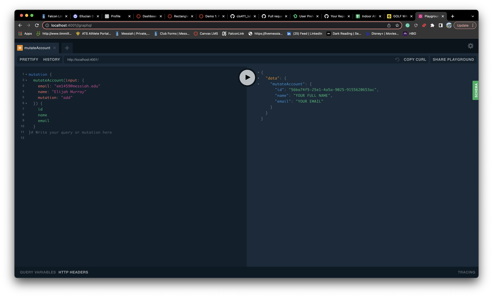

# Lab Report: Monitoring
___
**Course:** CIS 411, Spring 2021  
**Instructor(s):** [Trevor Bunch](https://github.com/trevordbunch)  
**Name:** Elijah Murray  
**GitHub Handle:** eliguy5474  
**Repository:** https://github.com/eliguy5474?tab=repositories 
**Collaborators:** 
___

# Step 1: Fork this repository
- [Fork Repo](https://github.com/eliguy5474/cis411_lab5_Monitoring)

# Step 2: Clone your forked repository from the command line
- My GraphQL response from adding myself as an account on the test project
- 
```
{
  "data": {
    "mutateAccount": {
      "id": "56ba74f5-25e1-4a5a-9025-9155620653ac",
      "name": "Elijah Murray",
      "email": "em1459@messiah.edu"
    }
  }
}
```

# Step 3: Signup for and configure New Relic
- The chosen name of your New Relic ```app_name``` configuration
```
app_name: ['Lab 5']
```

# Step 4: Exercising the application / generating performance data

_Note: No lab notes required._

# Step 5: Explore your performance data
* What are your observations regarding the performance of this application? 
  > When ran, my computer usage startde to spike and to continue to get higher.
* Is performance even or uneven? 
  > The performance was pretyy uneven.
* Between queries and mutations, what requests are less performant? 
  > I think that queries are better performing than mutations. Mutations is changing data that is already there which is making mutations less performant
* Among the less performant requests, which ones are the most problematic?
  > For some reason, the last two requests were by far the most difficult. The first one was the one that contained the term "everything." This one, in my opinion, took a while because it had to look through everything and retrieve all orders that contained just one phrase. I believe that doing this required a lot of energy. The last one, which was the second to be problematic, would always give me an error when I executed it, which was frequently.

# Step 6: Diagnosing an issue based on telemetry data
* Within the transactions you're examining, what segment(s) took the most time?
  > The segment that took the longest time to complete was Query #6. This segment took 65.425 seconds compared to the slowest time being 0.0410 because query #7 came back with an error instead of results. 
* Using New Relic, identify and record the least performant request(s).
  > The final proposal was the least productive. This query produced a mistake, which is visible in my newrelic and resulted in a 100% error rate.
* Using the Transaction Trace capability in New Relic, identify which segment(s) in that request permeation is/are the most problematic and record your findings.
  > I think that the issue is that Query #7 was never able to run correctly.
* Recommend a solution for improving the performance of those most problematic request(s) / permeation(s).
  > Figuring out what's going on with Query#7 and why it comes back as an error.

# Step 7: Submitting a Pull Request
_Note: No lab notes required._

# Step 8: [EXTRA CREDIT] Address the performance issue(s)
For the purposes of gaining 25% extra credit on the assignment, perform any of the following:
1. Adjust the diagnosed slow call(s) to improve performance. 
2. Verify the improved performance in New Relic, **including data and/or screenshots in your lab report**.
2. Check in those changes and **note your solution(s)** in your lab report.