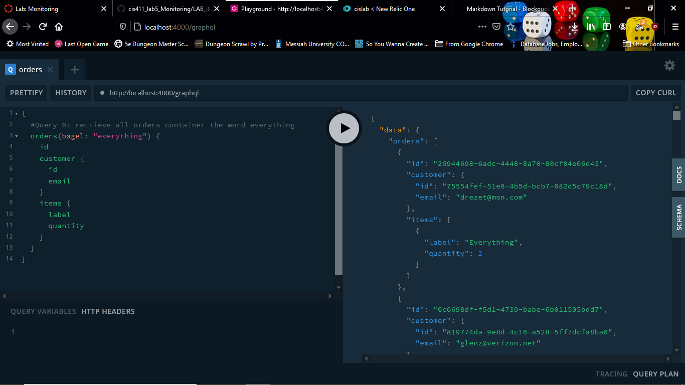
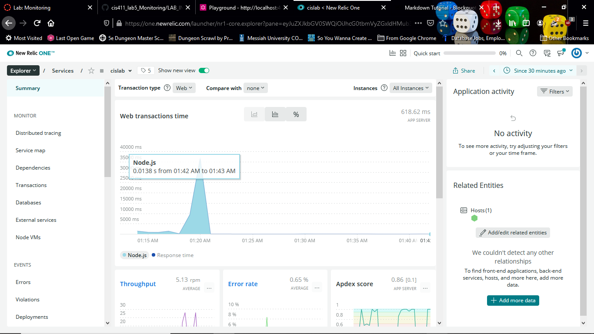
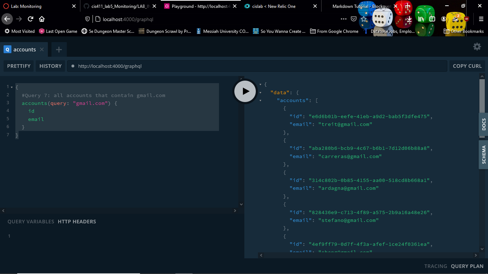

# Lab Report: Monitoring
___
**Course:** CIS 411, Spring 2021  
**Instructor(s):** [Trevor Bunch](https://github.com/trevordbunch)  
**Name:** Adam Hungerford
**GitHub Handle:** [adamhungerford](https://github.com/adamhungerford)  
**Repository:** https://github.com/adamhungerford/cis411_lab5_Monitoring  
**Collaborators:** None
___

# Step 1: Fork this repository
- https://github.com/adamhungerford/cis411_lab5_Monitoring

# Step 2: Clone your forked repository from the command line
- My GraphQL response from adding myself as an account on the test project
```
{
  "data": {
    "mutateAccount": {
      "id": "be528c9d-79d9-4763-af10-85a65c0de093",
      "name": "Adam Hungerford",
      "email": "ah1600@messiah.edu"
    }
  }
}
```

# Step 3: Signup for and configure New Relic
- The chosen name of your New Relic ```app_name``` configuration
```
app_name: ['MYAPP']
```

# Step 4: Exercising the application / generating performance data

_Note: No lab notes required._

# Step 5: Explore your performance data

* What are your observations regarding the performance of this application? 
  > Most tasks take between 0 and 15 seconds to complete, with the majority of those taking less than 5.
* Is performance even or uneven? 
  > Performance is uneven depending on the task.
* Between queries and mutations, what requests are less performant? 
  > Queries take more time - less performant.
* Among the less performant requests, which ones are the most problematic?
  > Searching all fields takes a long time. Also, erroneous queries cause errors.

# Step 6: Diagnosing an issue based on telemetry data
* Within the transactions you're examining, what segment(s) took the most time?
  > Primarily "remainder." In the shortest querys, however, "middleware" takes about half the time.
* Using New Relic, identify and record the least performant request(s).
  > Queries 6 and 7 were the most problematic.
* Using the Transaction Trace capability in New Relic, identify which segment(s) in that request permeation is/are the most problematic and record your findings.
  > "Remainder."
* Recommend a solution for improving the performance of those most problematic request(s) / permeation(s).
  > Query 6: Only query the bagel field. `bagel:everything`
  > Query 7: It should look like this:
  >>```{```
  >>``` accounts(query: "gmail.com") {```
  >>```   id```
  >>```   email```
  >>``` }```
  >>```}```

# Step 7: Submitting a Pull Request
_Note: No lab notes required._

# Step 8: [EXTRA CREDIT] Address the performance issue(s)
For the purposes of gaining 25% extra credit on the assignment, perform any of the following:
1. Adjust the diagnosed slow call(s) to improve performance. 
2. Verify the improved performance in New Relic, **including data and/or screenshots in your lab report**.
3. Check in those changes and **note your solution(s)** in your lab report.



