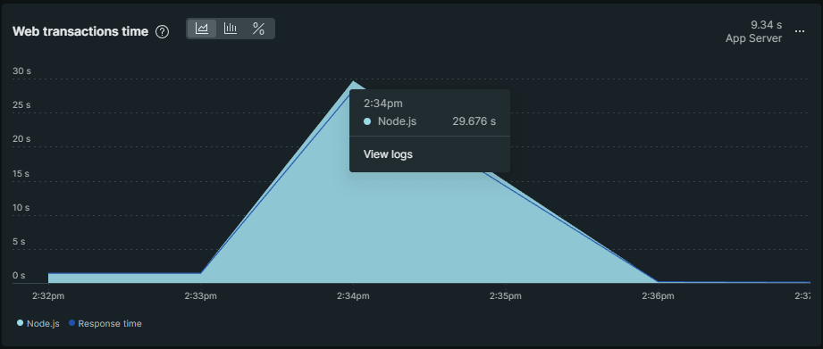
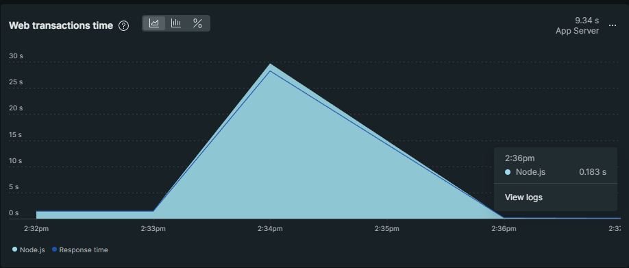

# Lab Report: Monitoring
___
**Course:** CIS 411, Spring 2021  
**Instructor(s):** [Trevor Bunch](https://github.com/trevordbunch)  
**Name:** Aidan Hubley  
**GitHub Handle:** aidan-hubley  
**Repository:** [Your Forked Repository](https://github.com/aidan-hubley/cis411_lab5_Monitoring)  
**Collaborators:** ChatGPT - rt1252
___

# Step 1: Fork this repository
- The URL of my forked repository: [Your Forked Repository](https://github.com/aidan-hubley/cis411_lab5_Monitoring)

# Step 2: Clone your forked repository from the command line
- My GraphQL response from adding myself as an account on the test project
```
{
  "data": {
    "mutateAccount": {
      "id": "bacd0e7b-ca8a-4752-be75-c2f551162012",
      "name": "Aidan Hubley",
      "email": "ah1632@messiah.edu"
    }
  }
}
```

# Step 3: Signup for and configure New Relic
- The chosen name of your New Relic ```app_name``` configuration
```
app_name: ['<cislab>']
```

# Step 4: Exercising the application / generating performance data

_Note: No lab notes required._

# Step 5: Explore your performance data
* What are your observations regarding the performance of this application? 
  > Overall, most of the queries performed quickly, but some took longer than others. The 6th query took the longest. My average web transaction time was 5.12s, an average throughput of 0.75 rpm, and an average error rate of 11.11%
* Is performance even or uneven? 
  > The performance is even, most queries were remarkable quicker than the outlying slower few.
* Between queries and mutations, what requests are less performant? 
  > Queries are less performant than mutations, the queries inherently require the slow process of searching for something, while mutations don't.
* Among the less performant requests, which ones are the most problematic?
  > The 7th request is the most problematic, it results in an error. The 'items' field displays an error, by removing it you will be provided with a list of 'id's.

# Step 6: Diagnosing an issue based on telemetry data
* Within the transactions you're examining, what segment(s) took the most time?
  > The segement: "queryOrdersBySearchTerm" took the most time by a large margin. 98.64%
* Using New Relic, identify and record the least performant request(s).
  > The least performant request are requests that search the data without parameters; they use the "query: " command.
* Using the Transaction Trace capability in New Relic, identify which segment(s) in that request permeation is/are the most problematic and record your findings.
  > The segment: "queryOrdersBySearchTerm" is the most problematic.
* Recommend a solution for improving the performance of those most problematic request(s) / permeation(s).
  > A limited result pool would increase performance but also limit the output for queries. Also, Forcing the "query: " command to utilize specific categories would improve performance.

# Step 7: Submitting a Pull Request
_Note: No lab notes required._

# Step 8: [EXTRA CREDIT] Address the performance issue(s)
For the purposes of gaining 25% extra credit on the assignment, perform any of the following:
1. Adjust the diagnosed slow call(s) to improve performance. 
* The proposed solution to allow query 6 to perform better: "query" should be "bagel" instead

2. Verify the improved performance in New Relic, **including data and/or screenshots in your lab report**.
* Verification that the change from query to bagel improved performance:
* With 'query: '

* With 'bagel: '


3. Check in those changes and **note your solution(s)** in your lab report.
* Solution included changing the vague and process heavy "query: " to "bagel: "