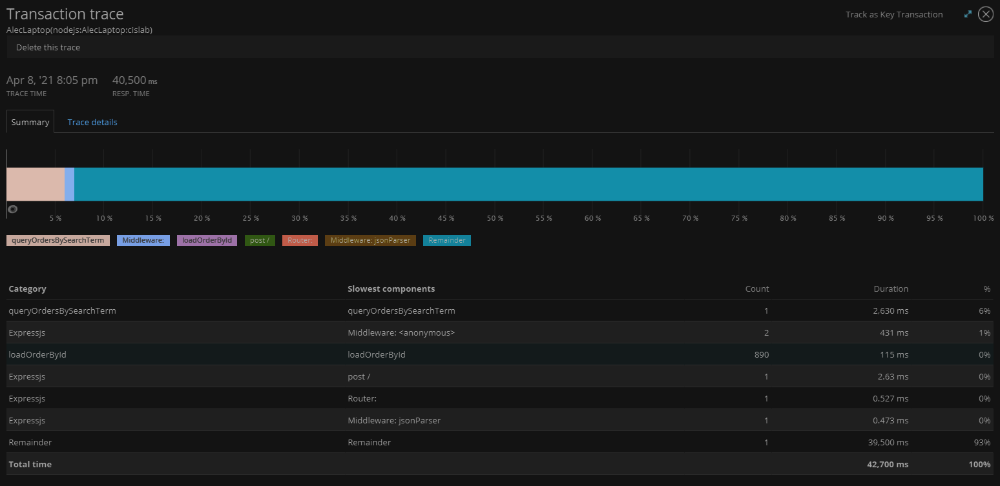

# Lab Report: Monitoring
___
**Course:** CIS 411, Spring 2021  
**Instructor(s):** [Trevor Bunch](https://github.com/trevordbunch)  
**Name:** Alec Chappell  
**GitHub Handle:** [@alecclyde](https://github.com/alecclyde)  
**Repository:** [Alecclyde's Forked Repository](https://github.com/alecclyde/cis411_lab5_Monitoring)  
**Collaborators:** 
___

# Step 1: Fork this repository
- The URL of my forked repository

# Step 2: Clone your forked repository from the command line
- My GraphQL response from adding myself as an account on the test project
```
{
  "data": {
    "mutateAccount": {
      "id": "7d1f4ffc-e1e8-4029-9965-3f6054506498",
      "name": "Alec Chappell",
      "email": "ac1474@messiah.edu"
    }
  }
}
```

# Step 3: Signup for and configure New Relic
- The chosen name of your New Relic ```app_name``` configuration
```
app_name: ['cislab']
```

# Step 4: Exercising the application / generating performance data

_Note: No lab notes required._

# Step 5: Explore your performance data
* What are your observations regarding the performance of this application? 
  >Through my usage of this application, I came up with these numbers on resource usage: 
  >> 29.7% CPU peak  
  60.2% Memory peak  
  55.1% Storage usage  
  Average of 721 ms response time  
  8.13 rpm throughput average

* Is performance even or uneven? 
  > The tests were incredibly uneven, some tests were executed within a second, and others took nearly 45 seconds (42.7s).
* Between queries and mutations, what requests are less performant? 
  > Queries did significantly worse when it came to performance. Out of all functional queries and mutations, no mutation took longer than any of the queries.
* Among the less performant requests, which ones are the most problematic?
  > The query that had us search for "everything" had us waiting about 42.7 seconds for the finish. It was by far the most intensive query or mutation, lasting way longer than any other because it was pulling the most information.
 
# Step 6: Diagnosing an issue based on telemetry data
* Within the transactions you're examining, what segment(s) took the most time?
  > Our query for everything was docked at 42,700ms.
* Using New Relic, identify and record the least performant request.
``` graphql

  #Query 6: retrieve all orders container the word everything
  orders(query: "everything") {
    id
    customer {
      id
      email
    }
    items {
      label
      quantity
    }
  }
}
```
* Using the Transaction Trace capability in New Relic, identify which segment(s) in that request permeation is/are the most problematic and record your findings.
  > Remainder was the most significant segment taking 93% of the time.  
  queryOrdersBySearchTerm took the second highest percentage of time at 6%.  
   
* Recommend a solution for improving the performance of those most problematic request(s) / permeation(s).
  > Pulling everything in the database is going to consistantly take the most time because it pulls **everything**. Unless the entire pull is necessary, a query must be refined to keep the transaction time low. 

# Step 7: Submitting a Pull Request
_Note: No lab notes required._

# Step 8: [EXTRA CREDIT] Address the performance issue(s)
For the purposes of gaining 25% extra credit on the assignment, perform any of the following:
1. Adjust the diagnosed slow call(s) to improve performance. 
2. Verify the improved performance in New Relic, **including data and/or screenshots in your lab report**.
2. Check in those changes and **note your solution(s)** in your lab report.