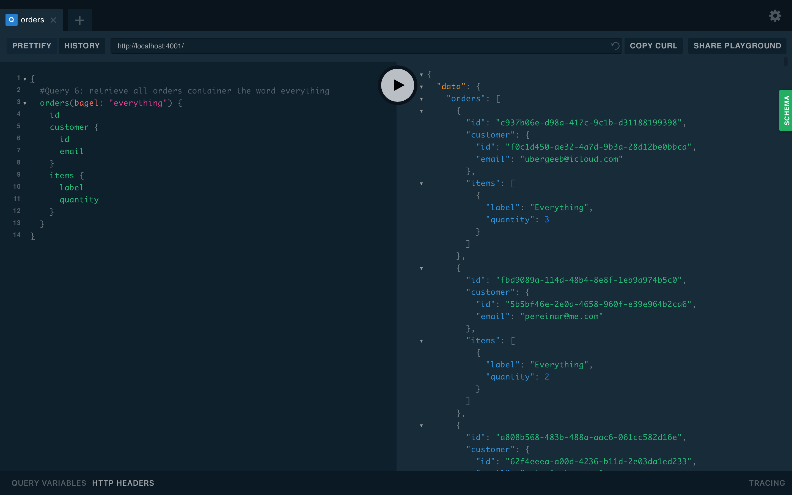

# Lab Report: Monitoring
___
**Course:** CIS 411, Spring 2022  
**Instructor(s):** [Trevor Bunch](https://github.com/trevordbunch)  
**Name:** Your Name  
**GitHub Handle:** cmcculler1  
**Repository:**  Cmcculler1/cis411_lab5_Monitoring
 
**Collaborators:** 
richard-pokrivka
___

# Step 1: Fork this repository
- https://github.com/Cmcculler1/cis411_lab5_Monitoring.git

# Step 2: Clone your forked repository from the command line
- My GraphQL response from adding myself as an account on the test project
```
{
  "data": {
    "mutateAccount": {
      "id": "5dc8a13f-5df0-478f-a29a-4e24ae327149",
      "name": "Corum McCuller",
      "email": "cm1564@messiah.edu"
    }
  }
}
```

# Step 3: Signup for and configure New Relic
- The chosen name of your New Relic ```app_name``` configuration
```
app_name: ['<cislab>']
```

# Step 4: Exercising the application / generating performance data

_Note: No lab notes required._

# Step 5: Explore your performance data
* What are your observations regarding the performance of this application? 
  > Query numbers 1 and 6 took much longer than the rest and 7 did not run because of an error.
* Is performance even or uneven? 
  > Performance was very uneven between queries. 
* Between queries and mutations, what requests are less performant? 
  > The queries were less performant, because of the long performance times compared to the mutations.
* Among the less performant requests, which ones are the most problematic?
  > #7 was problematic because it contained and error and #6 because of the long performance time. 

# Step 6: Diagnosing an issue based on telemetry data
* Within the transactions you're examining, what segment(s) took the most time?
  > The segment that took the longest was the one titled remainder
* Using New Relic, identify and record the least performant request(s).
  > Query 6 was the least performant request because it was a query by word and it took 47,300 ms.
* Using the Transaction Trace capability in New Relic, identify which segment(s) in that request permeation is/are the most problematic and record your findings.
  > The most problematic request was the queryOrderBySearchTime
* Recommend a solution for improving the performance of those most problematic request(s) / permeation(s).
  > Make the requests more specififc so it does not have to search as much as it would if searching the whole query.

# Step 7: Submitting a Pull Request
_Note: No lab notes required._

# Step 8: [EXTRA CREDIT] Address the performance issue(s)
For the purposes of gaining 25% extra credit on the assignment, perform any of the following:

Resolved the slow performance time for #6 by replacing "query" with "bagel" so it did not have to search the whole query for "everything"

