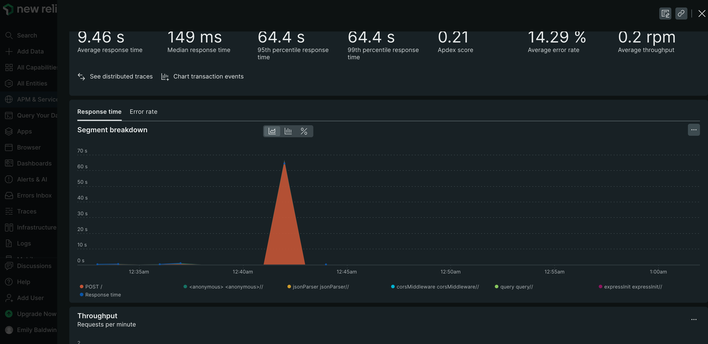

# Lab Report: Monitoring
___
**Course:** CIS 411, Spring 2021  
**Instructor(s):** [Trevor Bunch](https://github.com/trevordbunch)  
**Name:** Emily Baldwin 

**GitHub Handle:** ebaldwin2023 

**Repository:** https://github.com/ebaldwin2023/cis411_lab5_Monitoring  
**Collaborators:** NONE
___

# Step 1: Fork this repository
- [The URL of my forked repository](https://github.com/ebaldwin2023/cis411_lab5_Monitoring)

# Step 2: Clone your forked repository from the command line
- My GraphQL response from adding myself as an account on the test project
```
{
  "data": {
    "mutateAccount": {
      "id": "31724672-e057-4d88-94b3-b9bceb2af588",
      "name": "Emily Baldwin",
      "email": "ea1230@messiah.edu"
    }
  }
}
```

# Step 3: Signup for and configure New Relic
- The chosen name of your New Relic ```app_name``` configuration
```
app_name: ['CISLab5']
```

# Step 4: Exercising the application / generating performance data

_Note: No lab notes required._

# Step 5: Explore your performance data
* What are your observations regarding the performance of this application? 
  > I noticed a climb in computer usage when I started running these queries in GraphiQL. 
* Is performance even or uneven? 
  > Performance was extremely uneven. The first several simple queries were fast and basic for them to run through. However, as soon as the "everything" query was an input into GraphiQL, this took substantially longer to complete than the rest.
* Between queries and mutations, what requests are less performant? 
  > In my opinion, after seeing both run and reviewing the outcome in new relic, I think that queries are better performing than mutations. I think this could be because when performing a query, all of the data is already there, you are just writing a "question" to that data. While on the flipside, a mutation is adding or changing data that is already there, causing a mutation to be less performant.
* Among the less performant requests, which ones are the most problematic?
  > By far, for some reason, the request that was the most problematic were the last 2. The first one was the query with the word "everything" in it. I think this one took a long time becuase it had to search through everything and retrieve ALL orders that had 1 single word. I think this used a lot of energy to do this. The second problematic one was the last- which was just giving me an error any time I ran it- which was several times. The segment that took the longest after looking at Post / was the "queryOrderBySearchTerm. This took 70.84% of the usage up. 


I just wanted to post a screenshot of New Relic and how much time it took the 6th query to be complete! This was the response time...


# Step 6: Diagnosing an issue based on telemetry data
* Within the transactions you're examining, what segment(s) took the most time?
  > The segment that took the longest time to complete was Query #6. This segment took 64.415 seconds compared to the slowest time being 0.0397 because this query (#7) generated an error instead of results. 
* Using New Relic, identify and record the least performant request(s).
  > The least performant request was the last query. This query simply generated an error- causing for a 100% error rate that can be viewed in my new relic.
* Using the Transaction Trace capability in New Relic, identify which segment(s) in that request permeation is/are the most problematic and record your findings.
  > Query Orders by Search Term seems to be taking the longest - but for the problematic query, I think the issue lies in the fact that the request was never even processed by GraphiQL. 
* Recommend a solution for improving the performance of those most problematic request(s) / permeation(s).
  > I think the best solution, or at least a good starting solution, would be to have the GraphiQL queries more refined and not so broad- I've noticed that when the queries are extrememly broad, it takes a long time for the computer to go through every single thing to ensure it has checked everything- this takes up more time and CPU usage. Also- figuring out more information on the 7th query having a 100% error rate- this would need to be done ASAP- high error rates, especially 100%, is BAD.

# Step 7: Submitting a Pull Request
_Note: No lab notes required._

