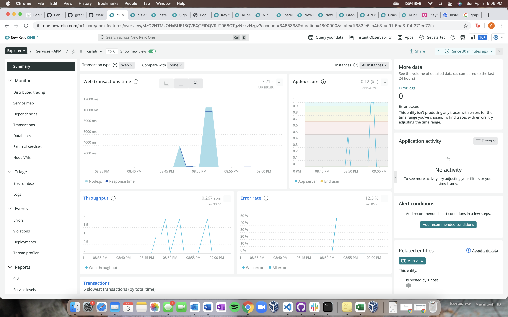

# Lab Report: Monitoring
___
**Course:** CIS 411, Spring 2021  
**Instructor(s):** [Trevor Bunch](https://github.com/trevordbunch)  
**Name:** Grace Schlauder  
**GitHub Handle:** https://github.com/grace-schl  
**Repository:** [Your Forked Repository](https://github.com/grace-schl/cis411_lab5_Monitoring)   
**Collaborators:** [Michael Mourelatos](https://github.com/MichaelMourelatos) and [Andrew Coldsmith](https://github.com/andrewcoldsmith)
___

# Step 1: Fork this repository
- [The URL of my forked repository](https://github.com/grace-schl/cis411_lab5_Monitoring)

# Step 2: Clone your forked repository from the command line
- My GraphQL response from adding myself as an account on the test project
```
{
  "data": {
    "mutateAccount": {
      "id": "739dbc28-6aa3-44ac-b1ea-f2ff883f08cf",
      "name": "YOUR FULL NAME",
      "email": "YOUR EMAIL"
    }
  }
}
```

# Step 3: Signup for and configure New Relic
- The chosen name of your New Relic ```app_name``` configuration
```
app_name: ['<cislab>']
```

# Step 4: Exercising the application / generating performance data

_Note: No lab notes required._

# Step 5: Explore your performance data
* What are your observations regarding the performance of this application? 
  > The performance of this application is pretty quick except for when it came to queries 1 and 6. These two queries took a bit longer to run. 
* Is performance even or uneven? 
  > Performance is uneven because of the varying response times for the different queries.
* Between queries and mutations, what requests are less performant? 
  > The queries were less performant. Some of the queries took way more than 1 millisecond to complete, where the mutations only took a few milliseconds. 
* Among the less performant requests, which ones are the most problematic?
  > The most problematic requests were queries 6 and 7. Query 6 took over 3,000 ms to complete and query 7 had an error that did not run the query properly.

# Step 6: Diagnosing an issue based on telemetry data
* Within the transactions you're examining, what segment(s) took the most time?
  > The segment titled "Remainder" was the one that took the longest. It took over 2,000 ms while next highest took 631 ms (loadOrderById).
* Using New Relic, identify and record the least performant request(s).
  > The least performant request was query 6 which took over 3,000 ms to complete.
* Using the Transaction Trace capability in New Relic, identify which segment(s) in that request permeation is/are the most problematic and record your findings.
  > The most problematic section is "queryOrderBySearchTerm" because of the 890 fast method calls that it has to sift through. These all add up, creating a problem.
* Recommend a solution for improving the performance of those most problematic request(s) / permeation(s).
  > The best way to fix these problematic queries is to make them more specific so that the query isn't searching the entire database. This way the query will have less to searching making the response time shorter.

# Step 7: Submitting a Pull Request
_Note: No lab notes required._

# Step 8: [EXTRA CREDIT] Address the performance issue(s)

**Query 1**  
In this query, changing the parameter from "query" to "location" fixed the performance problem because the query didn't have to search the entire database, only under location.


**Query 6**  
Changing "query" to "bagel" helped the performance of this query similar to how it helped query 1. The query no longer had to search the entire database.


**Query 7**  
Changing the items that the query was looking for allowed this query to run. "Items" could not be found because that information is not under "accounts". I kept "id" but took away "items" was well as everything underneath it and added "name" and "email" instead.


**NewRelic**  
This is the transaction image all three of these queries being ran in their original form and then again after being changed.
