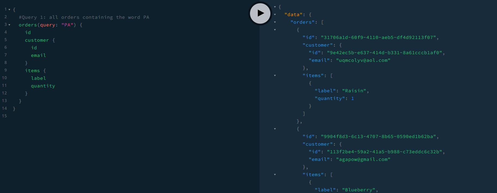

# Lab Report: Monitoring
___
**Course:** CIS 411, Spring 2021  
**Instructor(s):** [Trevor Bunch](https://github.com/trevordbunch)  
**Name:** Hope Tressler  
**GitHub Handle:** hopetressler  
**Repository:** https://github.com/hopetressler/cis411_lab5_Monitoring.git 
**Collaborators:** 
___

# Step 1: Fork this repository
- https://github.com/hopetressler/cis411_lab5_Monitoring.git

# Step 2: Clone your forked repository from the command line
- My GraphQL response from adding myself as an account on the test project
```
{
  "data": {
    "mutateAccount": {
      "id": "befd413d-2422-4510-82ef-570c790428be",
      "name": "Hope Tressler",
      "email": "ht1213@messiah.edu"
    }
  }
}
```

# Step 3: Signup for and configure New Relic
- The chosen name of your New Relic ```app_name``` configuration
```
app_name: ['cislab']
```

# Step 4: Exercising the application / generating performance data

_Note: No lab notes required._

# Step 5: Explore your performance data
* What are your observations regarding the performance of this application? 
  > The more specific the search is, the quicker and more efficient it is completed. For more vague searches like 'everything', it takes a long time for the search to be complete. 
* Is performance even or uneven? 
  > I would say the performance is uneven due to how vague some of the queries are. 
* Between queries and mutations, what requests are less performant? 
  > The queries are less performant, likely due to the need for the queries to search through a lot of data.
* Among the less performant requests, which ones are the most problematic?
  > While the sixth request was slow, the seventh was probably the most problematic. This is because it results in an error due to the 'items' field.

**Some Lab Screenshots**





# Step 6: Diagnosing an issue based on telemetry data
* Within the transactions you're examining, what segment(s) took the most time?
  > queryOrdersBySearchTerm took up the most time by far.
* Using New Relic, identify and record the least performant request(s).
  > The least performant requests are the ones with the "query: " command. They are the requests that search the data without parameters. 
* Using the Transaction Trace capability in New Relic, identify which segment(s) in that request permeation is/are the most problematic and record your findings.
  > The most problematic segment is the "queryOrdersBySearchTerm" segment.
* Recommend a solution for improving the performance of those most problematic request(s) / permeation(s).
  > Using more specific search requests would result in a limited result pool. This would increase the performance. 

# Step 7: Submitting a Pull Request
_Note: No lab notes required._

# Step 8: [EXTRA CREDIT] Address the performance issue(s)
For the purposes of gaining 25% extra credit on the assignment, perform any of the following:
1. Adjust the diagnosed slow call(s) to improve performance. 
2. Verify the improved performance in New Relic, **including data and/or screenshots in your lab report**.
2. Check in those changes and **note your solution(s)** in your lab report.