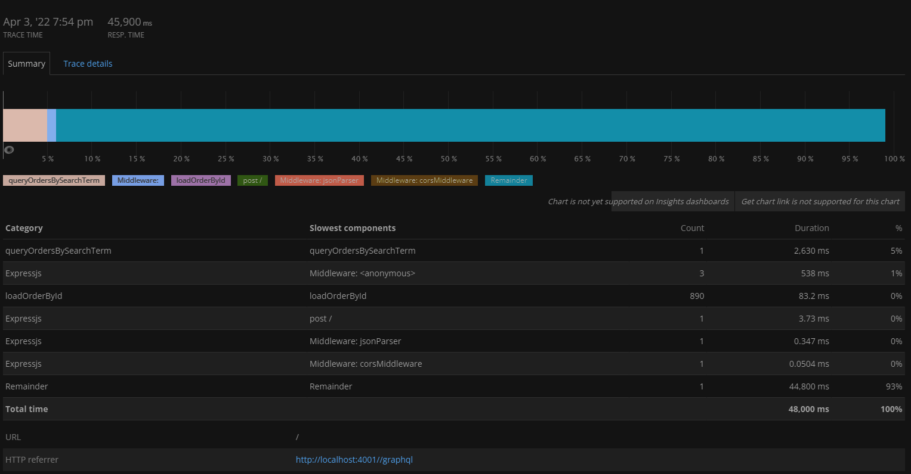

# Lab Report: Monitoring
___
**Course:** CIS 411, Spring 2021  
**Instructor(s):** [Trevor Bunch](https://github.com/trevordbunch)  
**Name:** Isaac Ho
**GitHub Handle:** isaachhm 
**Repository:** https://github.com/isaachhm/cis411_lab5_Monitoring.git
**Collaborators:** 
___

# Step 1: Fork this repository
- The URL of my forked repository

# Step 2: Clone your forked repository from the command line
- My GraphQL response from adding myself as an account on the test project
```
{
  "data": {
    "mutateAccount": {
      "id": "0a1fe524-2a87-4d0b-88a1-f23424aeff64",
      "name": "Isaac Ho",
      "email": "ih1171@messiah.edu"
    }
  }
}
```

# Step 3: Signup for and configure New Relic
- The chosen name of your New Relic ```app_name``` configuration
```
app_name: ['cislab5']
```

# Step 4: Exercising the application / generating performance data

_Note: No lab notes required._

# Step 5: Explore your performance data
* What are your observations regarding the performance of this application? 
  > All the queries take different amounts of time to complete their task. 
* Is performance even or uneven? 
  > Performance is uneven.
* Between queries and mutations, what requests are less performant? 
  > Queries are definitely less performant. Fetching data from a large database takes a longer time and more effort than adding data to a system.
* Among the less performant requests, which ones are the most problematic?
  > There was one query that returned an error and that query was the most problematic. It was the query that was getting all account with "gmail.com".

# Step 6: Diagnosing an issue based on telemetry data
* Within the transactions you're examining, what segment(s) took the most time?
  > The segment called "Remainder" took the most time.
* Using New Relic, identify and record the least performant request(s).
  > Query 6 took the longest time, taking almost one minute to return each time.
* Using the Transaction Trace capability in New Relic, identify which segment(s) in that request permeation is/are the most problematic and record your findings.
  > Looking at the Transaction Trace capability, we can see that Remainder is the most problematic as it took the longest time.
  
* Recommend a solution for improving the performance of those most problematic request(s) / permeation(s).
  > Removing the quantity of the instances that the word "Everything" comes up in an order will help with the speed of the query. This is assuming that you will only need to know which order has the word "Everything" in it.

# Step 7: Submitting a Pull Request
_Note: No lab notes required._
