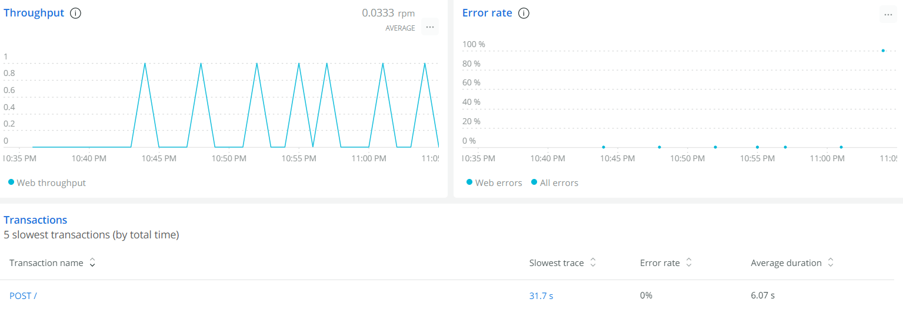

# Lab Report: Monitoring
___
**Course:** CIS 411, Spring 2022  
**Instructor(s):** [Trevor Bunch](https://github.com/trevordbunch)  
**Name:** Kylie Firestone  
**GitHub Handle:** kfirestone25   
**Repository:** https://github.com/kfirestone25/cis411_lab5_Monitoring 
___

# Step 1: Fork this repository
- https://github.com/kfirestone25/cis411_lab5_Monitoring

# Step 2: Clone your forked repository from the command line
- My GraphQL response from adding myself as an account on the test project
```
{
  "data": {
    "mutateAccount": {
      "id": "0ddba02d-fd9e-4548-a347-01d0a2c9f1e1",
      "name": "Kylie Lynne Firestone",
      "email": "kf1322@messiah.edu"
    }
  }
}
```

# Step 3: Signup for and configure New Relic
- The chosen name of your New Relic ```app_name``` configuration
```
app_name: ['cislab']
```

# Step 4: Exercising the application / generating performance data

_Note: No lab notes required._

# Step 5: Explore your performance data
* What are your observations regarding the performance of this application? 
  
  > 
  > 
  > * As shown above, New Relic provided four main graphics to showcase the performance of my application. The "web transaction time" showcased the wide range of average response times for all seven of my queries. While query 7 only took 36.3 ms, query 6 spiked with 31,700 ms. The throughput graphic actively shows me the number of requests my application was processing per minute. I only provided one query at a time so I could easily differentiate between them. The error rate was 0% for every query except 7, which was 100%. This was expected considering query 7 showcased an error when I ran it on graphql. Lastly, the Apdex score is based on user satisfaction. According to the site, the closer you are to one, the better. The application showed multiple one's and multiple zero's. After assessing the four graphics, it seems that our application is inconsistent in its performance. It performed really well for some queries, but not as good with others. 
  > * The host (aka my computer) is performing okay according to New Relic. It is definitely not doing a fantastic job. It has a response time of 5.21 seconds, a throughput rate of 0.0579 rpm and an error rate of 14.29%. 

* Is performance even or uneven? 
  > * The peformance of the application is very uneven. When it came to working through the seven different queries, our application possessed different web transaction times and Apdex scores, along with throughput and error rates for each one.

* Between queries and mutations, what requests are less performant? 
  > * Queries appear to be less performant in our application according to New Relic. 

* Among the less performant requests, which ones are the most problematic? 
  > * Query 6 had the longest web transaction time (31,700 ms).
  > * Query 7 could not run due to an error.

# Step 6: Diagnosing an issue based on telemetry data

Summary table of application performance:
| Request Number | Response Time | Error Rate |
|:---------------|:---------------------|------------|
| 1 | 3,810 ms | 0 |
| 2 | 110 ms | 0 |
| 3 | 393 ms | 0 |
| 4 | 63.7 ms | 0 |
| 5 | 387 ms | 0 |
| 6 | 31,700 ms | 0 |
| 7 | 35.5 ms | 1 |

* Within the transactions you're examining, what segment(s) took the most time?
  > Slowest Segments
  > * Expressjs post / 
  >   * 96.5% of time
  >   * Average Time - 5,030 ms
  > * Middleware: < anonymous > /
  >   * 3.4% of time
  >   * Average Time - 178 ms  

* Using New Relic, identify and record the least performant request(s).
  > * If I was the head of Quality Assurance, I would define a low performing request as one that includes a reasonably slow response time and a high error rate, meaning that it is not able to run successfully. 
  >   * Query 6 was the least performant request regarding web transaction time, which includes response time and node.js.
  >   * Query 7 had an error, meaning that it did not run at all. 

* Using the Transaction Trace capability in New Relic, identify which segment(s) in that request permeation is/are the most problematic and record your findings.

  > Query 6: Slowest Components
  > * Remainder
  >   * 30,800 ms
  >   * 91% of total duration
  > * queryOrdersBySearchTerm 
  >   * 2,580 ms
  >   * 8% of total duration

* Recommend a solution for improving the performance of those most problematic request(s) / permeation(s).
  > * Query 6 was very vague in providing information in which the computer was supposed to find. It simply was supposed to find items with the word "everything" in it. The application would have been faster if it was given more specific instructions. In the others, a specific location or type of food was given, providing the computer with a narrowed search. Therefore, it is important to remain purposeful when writing queries for an application to perform. 

# Step 7: Submitting a Pull Request
_Note: No lab notes required._
