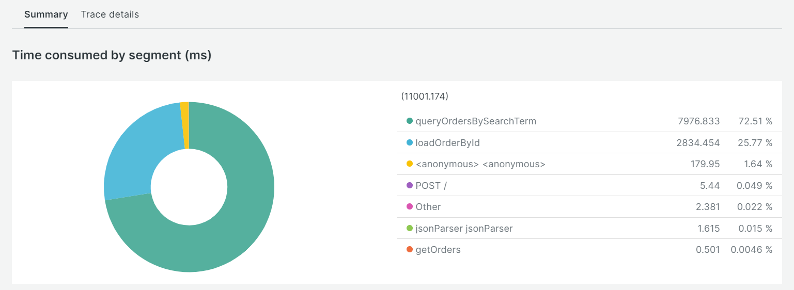

# Lab Report: Monitoring
___
**Course:** CIS 411, Spring 2023  
**Instructor(s):** [Trevor Bunch](https://github.com/trevordbunch)  
**Name:** Michael Shoul  
**GitHub Handle:** [m-shoul](https://github.com/m-shoul)  
**Repository:** [m-shoul / cis411_lab5_Monitoring](https://github.com/m-shoul/cis411_lab5_Monitoring)  
**Collaborators:** None
___

# Step 1: Fork this repository
* https://github.com/m-shoul/cis411_lab5_Monitoring

# Step 2: Clone your forked repository from the command line
- My GraphQL response from adding myself as an account on the test project
```
{
  "data": {
    "mutateAccount": {
      "id": "e17a9500-c405-4538-8a28-ad9d1d9296eb",
      "name": "Michael Shoul",
      "email": "ms1822@messiah.edu"
    }
  }
}
```

# Step 3: Sign up for and configure New Relic
* The chosen name of your New Relic ```app_name``` configuration
```
app_name: ['cis411']
```

# Step 4: Exercising the application / generating performance data

_Note: No lab notes required._

# Step 5: Explore your performance data
* What are your observations regarding the performance of this application? 
  > Overall, most of the queries ran relatively fast, but some of them took longer than expected. Query one and six were the slowest of them all. The average web transaction time on my host was 2.32 seconds, the average throughput was 0.9 rpm, and the error rate was 11.11%.
* Is performance even or uneven? 
  > The performance is vastly uneven as some queries took much longer than others. In New Relic, the chart of the web transaction time has various peaks representing the slower querying times.
* Between queries and mutations, what requests are less performant? 
  > In this assignment, queries are far less performant than mutations. Queries retrieve the data, while mutations are used to modify the data. The performance of the query depends on the amount of data being requested or the complexity of the query. However, it may be possible for a mutation to be slower than a query that retrieves a small amount of data.
* Among the less performant requests, which ones are the most problematic?
  > Query 7 is the most problematic because it raises an error. The error message starts with ```"Cannot query field \"items\" on type \"Account\"."```. I believe this query results in an error because the ```Accounts``` field is likely not defined to accept a query in the GraphQL schema.

# Step 6: Diagnosing an issue based on telemetry data
* Within the transactions you're examining, what segment(s) took the most time?
  > Within the transactions, ```queryOrderBySearchTerm``` took the most time at 3.61 seconds, consuming 76.75% of the total time.
* Using New Relic, identify and record the least performant request(s).
  > The least performant requests were the ones that searched the dataset using the ```query``` command. This is likely because there is no specified search parameter to return a specific set of results. 
* Using the Transaction Trace capability in New Relic, identify which segment(s) in that request permeation is/are the most problematic and record your findings.
  > The segment in the request permeation that is the most problematic is ```queryOrderBySearchTerm```.
* Recommend a solution for improving the performance of those most problematic request(s) / permeation(s).
  > To improve the performance of the most problematic requests, we could provide query arguments to filter the results of the query. For example, in the first query, we could change ```(query: "PA")``` to ```(location: "PA")``` to filter results that only include orders that are associated with Pennsylvania. In the sixth query, we could change ```(query: "everything")``` to ```(bagel: "everything")``` to search in the bagel field specifically. Finally, in query seven, we can get rid of the items field and only search for the name, id, and email.

# Step 7: Submitting a Pull Request
_Note: No lab notes required._

# Step 8: [EXTRA CREDIT] Address the performance issue(s)
For the purposes of gaining 25% extra credit on the assignment, perform any of the following:
1. Adjust the diagnosed slow call(s) to improve performance. 
  > The diagnosed slow calls I chose to improve were queries 1, 6 and 7. 
  
  ### Query 1:
  > To improve the speed of query 1, I changed the word ```query:``` to ```location:``` to search for the keyword "PA" in the "location" field specifically.
```
{
  orders(location: "PA") {
    id
    customer {
      id
      email
    }
    items {
      label
      quantity
    }
  }
}
```

 ### Query 6:
  > To improve the speed of query 6, I changed the word ```query:``` to ```bagel:``` to search for the keyword "everything" in the "bagel" field specifically.
```
{
  orders(bagel: "everything") {
    id
    customer {
      id
      email
    }
    items {
      label
      quantity
    }
  }
}
```
 ### Query 7:
 > To fix query 7, I got rid of the ```items``` field, and only queried the id, name, and email. This fixed the query and resulted in faster performance.

```
{
  accounts(query: "gmail.com") {
    id
    name
    email
  }
}
```

1. Verify the improved performance in New Relic, 

> Here are images comparing the query performance between the slower queries and the optimized queries.


> Response time of slow queries (left) and improved queries (right).


> Summary of time consumed by the slow queries.


> Summary of time consumed by the optimized queries.