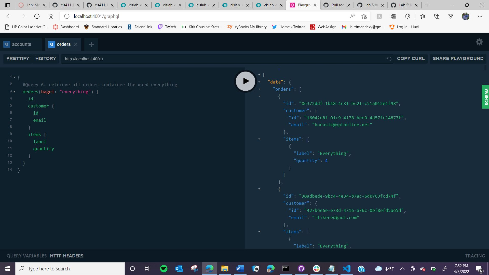
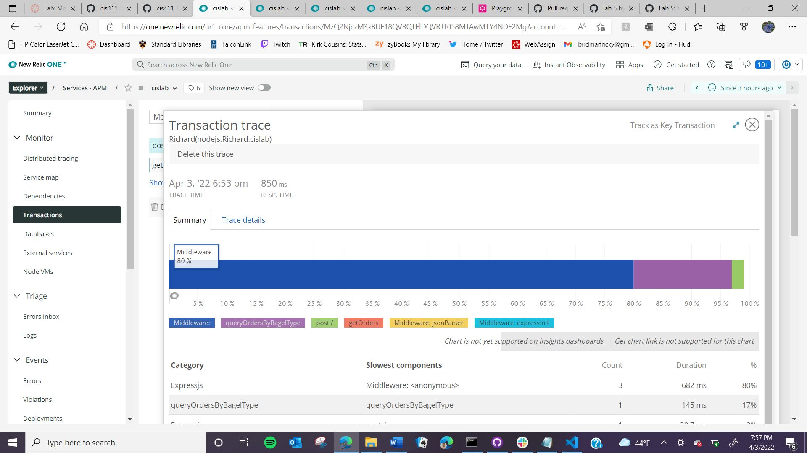

# Lab Report: Monitoring
___
**Course:** CIS 411, Spring 2022  
**Instructor(s):** [Trevor Bunch](https://github.com/trevordbunch)  
**Name:** Richard Pokrivka  
**GitHub Handle:** richard-pokrivka 
**Repository:** https://github.com/richard-pokrivka/cis411_lab5_Monitoring.git  
**Collaborators:** 
@cmcculler1

# Step 1: Fork this repository
[Forked Repository](https://github.com/richard-pokrivka/cis411_lab5_Monitoring.git)

# Step 2: Clone your forked repository from the command line
- My GraphQL response from adding myself as an account on the test project
```
{
  "data": {
    "mutateAccount": {
      "id": "135862bd-77f0-4c1c-8737-ff3fabc59780",
      "name": "Richard Pokrivka",
      "email": "rp1291@messiah.edu"
    }
  }
}
```

# Step 3: Signup for and configure New Relic
- The chosen name of your New Relic ```app_name``` configuration
```
app_name: ['<cislab>']
```

# Step 4: Exercising the application / generating performance data


# Step 5: Explore your performance data
* What are your observations regarding the performance of this application? 
  - Queries and 1 and 6 took significantly longer than the other queries. Query 7 did not run because of an error. The other queries were so quick I barely noticed them running. Query 6 also intially forced me to restart the localhost for it to run because it froze.

* Is performance even or uneven? 
  - The performance was uneven. Query 1 took 9,342 ms and another query took 9,088 ms while query 6 took 96,700 ms. Additionally, another query only took 728 ms so the performance was very uneven.

* Between queries and mutations, what requests are less performant? 
  - Queries were much less performant because of the time taken and were usually rated poorly while mutations took less than 100 ms.
  
* Among the less performant requests, which ones are the most problematic?
  - The most problematic were query 6 because of the amount of time it took and query 7 because it never ran because of the error.

# Step 6: Diagnosing an issue based on telemetry data
* Within the transactions you're examining, what segment(s) took the most time?
  - The segment that took the most time was the Remainder portion of query 6 which took 91,900 ms of the total 96,700 ms.

* Using New Relic, identify and record the least performant request(s).
  - Query 6 was the least performant request because it was a query by word and took 96,700 ms to complete.

* Using the Transaction Trace capability in New Relic, identify which segment(s) in that request permeation is/are the most problematic and record your findings.
  - In query 6, the most problematic request permeation was the queryOrdersBySearchTerm
* Recommend a solution for improving the performance of those most problematic request(s) / permeation(s).
  - Make the query more specific so the entire database does not need to be searched through which is why query 6 took so long.

# Step 7: Submitting a Pull Request
_Note: No lab notes required._

# Step 8: [EXTRA CREDIT] Address the performance issue(s)

   I resolved the slow performance time for query 6 by removing the word query and replacing it with Bagel which meant it did not have to run a query every single time while searching for the word everything which reduced the overall time.

   
   