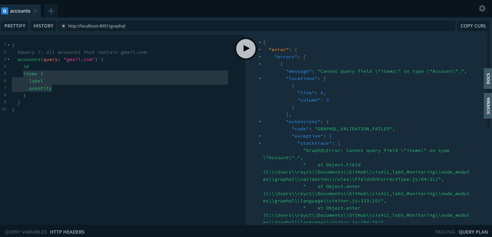

# Lab Report: Monitoring
___
**Course:** CIS 411, Spring 2021  
**Instructor(s):** [Trevor Bunch](https://github.com/trevordbunch)  
**Name:** Raymond Truex <br>
**GitHub Handle:** rt1252 <br>
**Repository:** [Your Forked Repository ](https://github.com/rt1252/cis411_lab5_Monitoring) <br>
**Collaborators:** NA
___

# Step 1: Fork this repository
- [The URL of my forked repository](https://github.com/rt1252/cis411_lab5_Monitoring)

# Step 2: Clone your forked repository from the command line
- My GraphQL response from adding myself as an account on the test project
```
{
  "data": {
    "mutateAccount": {
      "id": "c9b448d6-609a-44f7-ba1e-f3ce03cdb508",
      "name": "Raymond Truex",
      "email": "rt1252@messiah.edu"
    }
  }
}
```

# Step 3: Signup for and configure New Relic
- The chosen name of your New Relic ```app_name``` configuration
```
app_name: ['<cislab>']
```

# Step 4: Exercising the application / generating performance data

_Note: No lab notes required._

# Step 5: Explore your performance data
* What are your observations regarding the performance of this application? 
  > Most queries ran relatively fast, however some took longer than expected. The output of the queries is a list of orders that match the conditions described in the query. Query six took the longest by far, query one was also pretty slow. My host had an average response time of 251ms, throughput of 4.23 rpm, error rate of 1.57%, 0.25% CPU utilization, and 48.6 mb of memory usage. 

* Is performance even or uneven? 
  > The performance is definitely uneven, some queries take much longer to complete than others. 
 
* Between queries and mutations, what requests are less performant? 
  > Queries are certainly less performant than mutations, most of the queries required searching which can be slow depending on how the data is sorted and searched. As noted before queries 1 and 6 are noticeable slower than the rest. 

* Among the less performant requests, which ones are the most problematic?
  > Query 7 which uses the query: "gmail" is the most problematic. This query results in an error. I believe the error is caused because of the query is searching through the accounts for an email and then asking the search to find an item. The item would not be shown in the accounts list. To fix this error I removed the search of the category items, this showed all account ids with "gmail" in the email.

# Step 6: Diagnosing an issue based on telemetry data
* Within the transactions you're examining, what segment(s) took the most time?
  > I examined the slowest transaction and noticed that the slowest component was queryOrdersBySearchTerm as it took 98.96% of the total time. I checked the second slowest transaction and noticed almost identical results. 

* Using New Relic, identify and record the least performant request(s).
  > The least performant requests are the ones that search not using a category but search the whole dataset using the query: command. This makes searching much slower because there is not a specific category defined to search, causing much slower response times.

* Using the Transaction Trace capability in New Relic, identify which segment(s) in that request permeation is/are the most problematic and record your findings.
  > In all of the transactions the segment named queryOrdersBySearchTerm was the slowest.

* Recommend a solution for improving the performance of those most problematic request(s) / permeation(s).
  > Two things come to mind to increase efficiency. First the searches that use the query: operator should be replaced with the specific category of data that the request is actually searching for. For example in request 1 the query: operator should be replaced with location:. In request 6, the query: operator should be replaced with bagel:. In request 7 the query: operator should be replaced with a regex email search. The second thing that could improve the performance could be to limit to a certain number of results or searching by time which would prevent every item from being searched through. 

# Step 7: Submitting a Pull Request
_Note: No lab notes required._

# Step 8: [EXTRA CREDIT] Address the performance issue(s)
For the purposes of gaining 25% extra credit on the assignment, perform any of the following:
1. Adjust the diagnosed slow call(s) to improve performance. 
> I am going to follow my recommendations from above: <br>
> In request 1 the query: operator should be replaced with location:. <br>
>In request 6, the query: operator should be replaced with bagel:. <br>
>In request 7 the query: operator should be replaced with a regex email search. <br> 

2. Verify the improved performance in New Relic, **including data and/or screenshots in your lab report**.
>Request 1, response times from the original search to the updated search changed from 3375 ms to 60 ms.

>Request 6, response times from the original search to the updated search changed from 30028 ms to 359 ms.

>Request 7, for some reason I could not get the error to send a log to NewRelic, however you can see the before and after screenshots showing that the error has been fixed. <br>
Before:

After:

3. Check in those changes and **note your solution(s)** in your lab report.
>See step 8 part 1.