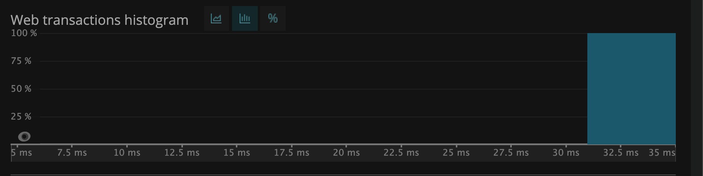

# Lab Report: Monitoring
___
**Course:** CIS 411, Spring 2021  
**Instructor(s):** [Trevor Bunch](https://github.com/trevordbunch)  
**Name:** Wesley Cheah </br>
**GitHub Handle:** [wesleyyycheah](https://github.com/wesleyyycheah)  
**Repository:** [https://github.com/wesleyyycheah/cis411_lab5_Monitoring](https://github.com/wesleyyycheah/cis411_lab5_Monitoring) </br>
**Collaborators:** 
___

# Step 1: Fork this repository
- URL: [https://github.com/wesleyyycheah/cis411_lab5_Monitoring](https://github.com/wesleyyycheah/cis411_lab5_Monitoring)

# Step 2: Clone your forked repository from the command line
- My GraphQL response from adding myself as an account on the test project
```
{
  "data": {
    "mutateAccount": {
      "id": "a3c54a94-091a-487e-9e74-9f164d1c4bee",
      "name": "Wesley Cheah",
      "email": "wesleycheah1997@gmail.com"
    }
  }
}
```

# Step 3: Signup for and configure New Relic
- The chosen name of your New Relic ```app_name``` configuration
```
app_name: ['cislab']
```

# Step 4: Exercising the application / generating performance data

_Note: No lab notes required._

# Step 5: Explore your performance data
* What are your observations regarding the performance of this application? 
  > The query performance of this application was varied. There were a few queries that were instant but there were a couple that made me doubt my machine's performance because the cursor was stuck in the loading animation for quite a while.
* Is performance even or uneven? 
  > The performance was uneven.
* Between queries and mutations, what requests are less performant? 
  > The first and second last queries were the least performant. In addition, the last query did not work at all.
* Among the less performant requests, which ones are the most problematic?
  > The last one as it only returned an error instead of information.

# Step 6: Diagnosing an issue based on telemetry data
* Within the transactions you're examining, what segment(s) took the most time?
  > The last segment took the most time.
* Using New Relic, identify and record the least performant request(s).
  > The least performant request was the "everything" query. That one took 27,944 milliseconds.
* Using the Transaction Trace capability in New Relic, identify which segment(s) in that request permeation is/are the most problematic and record your findings.
  > The segment that is the most problematic, which also took the longest, is the "everything" query and that took around 28 seconds.
* Recommend a solution for improving the performance of those most problematic request(s) / permeation(s).
  > Only query data that you need. For example, the "everything" query would not take such a long time if the user only queried information that he/she needed.

# Step 7: Submitting a Pull Request
_Note: No lab notes required._

# Step 8: [EXTRA CREDIT] Address the performance issue(s)
For the purposes of gaining 25% extra credit on the assignment, perform any of the following:
1. Adjust the diagnosed slow call(s) to improve performance. </br>
```
{
  #Query 7: all accounts that contain gmail.com
  accounts(query: "gmail.com") {
    id
    items {
      label
      quantity
    }
  }
}
```
</br>
What was wrong with this was the fact that in the table "accounts", there is no "items". There are other columns like "cell", "name", "id", and "email". So, to get rid of the error, we have to change "items" to one of the columns needed. For example: </br>

```
{
  #Query 7: all accounts that contain gmail.com
  accounts(query: "gmail.com") {
    id
    name
    email
    cell
  }
}
``` 
</br>
2. Verify the improved performance in New Relic, **including data and/or screenshots in your lab report**. </br>

So since the transaction did not go through since the table did not have an "items" column, we can use "id" or "email" to actually get what we need. </br>
 </br>
3. Check in those changes and **note your solution(s)** in your lab report. 
